Session 2 \| Gene expression analysis
================
Jonathan Maldonado
13/07/2023

Following the former pipeline, we were able to obtain a table with read
counts per gene of Arabidopsis. That table was generated using the
reduced version of the original sequencing files. For this pipeline, we
will use a similar file, containing gene counts obtained from the
analysis of the original .fastq files.

Open R Studio (or just R) and load the following libraries. Load each
library **one at a time** to be sure that the library is installed on
your system. Otherwise, remember to use
BiocManager::install(“packagename”).

``` r
library(edgeR)
library(knitr)
library(dplyr)
library(pvclust)
library(ggplot2)
require(gridExtra)
library(RColorBrewer)
library(mixOmics)
library(reshape2)
library(gplots)
library(mclust)
library(matrixStats)
```


Don’t forget to set the working directory right were your downloaded
files are. If you have previous RData file (from a previous session),
use the *load* command to load the session.

``` r
setwd("C:/tmp/S2")
#load("3_Pipeline-Gene_expression_analysis.RData")
```

## 1. Importing and formatting data

Start importing counts table and metadata associated to the samples,
previously downloaded from
[Data](https://github.com/ibioChile/Transcriptomics-R-Workshop-public/tree/master/Session2-Temporal_Analysis/Data)
folder.

``` r
counts <- read.table("fc0.counts_original.txt")
metadata <- read.table("metadata.txt", header=TRUE)
kable(head(metadata))
```

| Sample     | Tissue | Treatment | Replicate | Time |
|:-----------|:-------|:----------|----------:|-----:|
| SRR5440784 | Shoot  | None      |         1 |    0 |
| SRR5440785 | Shoot  | None      |         2 |    0 |
| SRR5440786 | Shoot  | None      |         3 |    0 |
| SRR5440814 | Shoot  | None      |         1 |    5 |
| SRR5440815 | Shoot  | None      |         1 |   10 |
| SRR5440816 | Shoot  | None      |         1 |   15 |

We will fix the header of counts leaving only the sample ID.

``` r
colnames(counts) <- sapply(strsplit(colnames(counts),".",fixed=TRUE), `[`, 1)
kable(head(counts))
```

|           | SRR5440784 | SRR5440785 | SRR5440786 | SRR5440814 | SRR5440815 | SRR5440816 | SRR5440817 | SRR5440818 | SRR5440819 | SRR5440820 | SRR5440821 | SRR5440822 | SRR5440823 | SRR5440824 | SRR5440825 | SRR5440826 | SRR5440827 | SRR5440828 | SRR5440829 | SRR5440830 | SRR5440831 | SRR5440832 | SRR5440833 | SRR5440834 | SRR5440835 | SRR5440836 | SRR5440837 | SRR5440838 | SRR5440839 | SRR5440840 |
|:----------|-----------:|-----------:|-----------:|-----------:|-----------:|-----------:|-----------:|-----------:|-----------:|-----------:|-----------:|-----------:|-----------:|-----------:|-----------:|-----------:|-----------:|-----------:|-----------:|-----------:|-----------:|-----------:|-----------:|-----------:|-----------:|-----------:|-----------:|-----------:|-----------:|-----------:|
| AT1G01010 |       1040 |       1512 |       1162 |        517 |        379 |        440 |        279 |        384 |        362 |        421 |        221 |        265 |        339 |        406 |        597 |        394 |        367 |        263 |        307 |        379 |        283 |        369 |        296 |        588 |        258 |        383 |        265 |        400 |        199 |        487 |
| AT1G01020 |        376 |        722 |        679 |        206 |        226 |        213 |        291 |        244 |        224 |        209 |        327 |        260 |        260 |        197 |        368 |        217 |        168 |        171 |        178 |        340 |        277 |        225 |        206 |        282 |        103 |        222 |        243 |        267 |        201 |        370 |
| AT1G03987 |          1 |          0 |          4 |          0 |          1 |          0 |          1 |          0 |          0 |          0 |          0 |          0 |          0 |          0 |          1 |          1 |          0 |          1 |          0 |          0 |          0 |          0 |          1 |          0 |          0 |          0 |          0 |          0 |          0 |          0 |
| AT1G01030 |        116 |        195 |        179 |         51 |         60 |         55 |         48 |         55 |         37 |         60 |         65 |         45 |         77 |         56 |         81 |         32 |         42 |         32 |         33 |         58 |         49 |         85 |         60 |         78 |         50 |         50 |         37 |         43 |         23 |         61 |
| AT1G01040 |       3931 |       6002 |       5513 |       1418 |       1503 |       1436 |       1415 |       1787 |       1571 |       2006 |       1340 |       1413 |       1702 |       1382 |       2453 |       1369 |       1388 |       1365 |       1257 |       1622 |       1458 |       1737 |       1384 |       2240 |        983 |       1627 |       1346 |       1833 |       1174 |       2119 |
| AT1G03993 |        327 |        564 |        513 |         94 |         94 |         81 |         38 |        106 |        109 |        155 |         65 |         82 |        111 |        116 |        182 |         75 |         65 |        122 |         65 |        101 |         98 |        105 |         67 |        151 |         89 |        108 |         73 |        143 |         80 |        195 |

This is a time-series data so, it would be good that samples order
follows the time-series.

``` r
metadata <- metadata %>% arrange(Time)
counts <- counts[,metadata$Sample]
dim(counts)
```

    ## [1] 32833    30

> This table has 30 samples and 32,833 genes.

## 2. Creating the edgeR object

To create the edgeR object we need the counts. Optionally we can group
samples by a factor. We will group samples by time.

``` r
dgList <- DGEList(counts=counts, genes=rownames(counts), group=metadata$Time)
```

Take a look to the created object. It contains data for \$counts,
\$samples and \$genes.

``` r
dgList
```

    ## An object of class "DGEList"
    ## $counts
    ##           SRR5440784 SRR5440785 SRR5440786 SRR5440814 SRR5440823 SRR5440832
    ## AT1G01010       1040       1512       1162        517        339        369
    ## AT1G01020        376        722        679        206        260        225
    ## AT1G03987          1          0          4          0          0          0
    ## AT1G01030        116        195        179         51         77         85
    ## AT1G01040       3931       6002       5513       1418       1702       1737
    ##           SRR5440815 SRR5440824 SRR5440833 SRR5440816 SRR5440825 SRR5440834
    ## AT1G01010        379        406        296        440        597        588
    ## AT1G01020        226        197        206        213        368        282
    ## AT1G03987          1          0          1          0          1          0
    ## AT1G01030         60         56         60         55         81         78
    ## AT1G01040       1503       1382       1384       1436       2453       2240
    ##           SRR5440817 SRR5440826 SRR5440835 SRR5440818 SRR5440827 SRR5440836
    ## AT1G01010        279        394        258        384        367        383
    ## AT1G01020        291        217        103        244        168        222
    ## AT1G03987          1          1          0          0          0          0
    ## AT1G01030         48         32         50         55         42         50
    ## AT1G01040       1415       1369        983       1787       1388       1627
    ##           SRR5440819 SRR5440828 SRR5440837 SRR5440820 SRR5440829 SRR5440838
    ## AT1G01010        362        263        265        421        307        400
    ## AT1G01020        224        171        243        209        178        267
    ## AT1G03987          0          1          0          0          0          0
    ## AT1G01030         37         32         37         60         33         43
    ## AT1G01040       1571       1365       1346       2006       1257       1833
    ##           SRR5440821 SRR5440830 SRR5440839 SRR5440822 SRR5440831 SRR5440840
    ## AT1G01010        221        379        199        265        283        487
    ## AT1G01020        327        340        201        260        277        370
    ## AT1G03987          0          0          0          0          0          0
    ## AT1G01030         65         58         23         45         49         61
    ## AT1G01040       1340       1622       1174       1413       1458       2119
    ## 32828 more rows ...
    ## 
    ## $samples
    ##            group lib.size norm.factors
    ## SRR5440784     0 41320115            1
    ## SRR5440785     0 60926929            1
    ## SRR5440786     0 62461021            1
    ## SRR5440814     5 17293869            1
    ## SRR5440823     5 18728454            1
    ## 25 more rows ...
    ## 
    ## $genes
    ##               genes
    ## AT1G01010 AT1G01010
    ## AT1G01020 AT1G01020
    ## AT1G03987 AT1G03987
    ## AT1G01030 AT1G01030
    ## AT1G01040 AT1G01040
    ## 32828 more rows ...

A more detailed view on \$samples will show you that they are grouped,
as expected.

``` r
kable(dgList$samples)
```

|            | group | lib.size | norm.factors |
|:-----------|:------|---------:|-------------:|
| SRR5440784 | 0     | 41320115 |            1 |
| SRR5440785 | 0     | 60926929 |            1 |
| SRR5440786 | 0     | 62461021 |            1 |
| SRR5440814 | 5     | 17293869 |            1 |
| SRR5440823 | 5     | 18728454 |            1 |
| SRR5440832 | 5     | 17873947 |            1 |
| SRR5440815 | 10    | 14054914 |            1 |
| SRR5440824 | 10    | 14086206 |            1 |
| SRR5440833 | 10    | 14027534 |            1 |
| SRR5440816 | 15    | 16583433 |            1 |
| SRR5440825 | 15    | 24783195 |            1 |
| SRR5440834 | 15    | 22452928 |            1 |
| SRR5440817 | 20    | 14582449 |            1 |
| SRR5440826 | 20    | 15257306 |            1 |
| SRR5440835 | 20    | 10146285 |            1 |
| SRR5440818 | 30    | 18398967 |            1 |
| SRR5440827 | 30    | 14846112 |            1 |
| SRR5440836 | 30    | 16928897 |            1 |
| SRR5440819 | 45    | 16571707 |            1 |
| SRR5440828 | 45    | 14868446 |            1 |
| SRR5440837 | 45    | 17898490 |            1 |
| SRR5440820 | 60    | 24313190 |            1 |
| SRR5440829 | 60    | 18276065 |            1 |
| SRR5440838 | 60    | 22102526 |            1 |
| SRR5440821 | 90    | 20396516 |            1 |
| SRR5440830 | 90    | 23416756 |            1 |
| SRR5440839 | 90    | 15149483 |            1 |
| SRR5440822 | 120   | 21133063 |            1 |
| SRR5440831 | 120   | 18059122 |            1 |
| SRR5440840 | 120   | 27663285 |            1 |

``` r
kable(head(dgList$counts)) # segment of the table
```

|           | SRR5440784 | SRR5440785 | SRR5440786 | SRR5440814 | SRR5440823 | SRR5440832 | SRR5440815 | SRR5440824 | SRR5440833 | SRR5440816 | SRR5440825 | SRR5440834 | SRR5440817 | SRR5440826 | SRR5440835 | SRR5440818 | SRR5440827 | SRR5440836 | SRR5440819 | SRR5440828 | SRR5440837 | SRR5440820 | SRR5440829 | SRR5440838 | SRR5440821 | SRR5440830 | SRR5440839 | SRR5440822 | SRR5440831 | SRR5440840 |
|:----------|-----------:|-----------:|-----------:|-----------:|-----------:|-----------:|-----------:|-----------:|-----------:|-----------:|-----------:|-----------:|-----------:|-----------:|-----------:|-----------:|-----------:|-----------:|-----------:|-----------:|-----------:|-----------:|-----------:|-----------:|-----------:|-----------:|-----------:|-----------:|-----------:|-----------:|
| AT1G01010 |       1040 |       1512 |       1162 |        517 |        339 |        369 |        379 |        406 |        296 |        440 |        597 |        588 |        279 |        394 |        258 |        384 |        367 |        383 |        362 |        263 |        265 |        421 |        307 |        400 |        221 |        379 |        199 |        265 |        283 |        487 |
| AT1G01020 |        376 |        722 |        679 |        206 |        260 |        225 |        226 |        197 |        206 |        213 |        368 |        282 |        291 |        217 |        103 |        244 |        168 |        222 |        224 |        171 |        243 |        209 |        178 |        267 |        327 |        340 |        201 |        260 |        277 |        370 |
| AT1G03987 |          1 |          0 |          4 |          0 |          0 |          0 |          1 |          0 |          1 |          0 |          1 |          0 |          1 |          1 |          0 |          0 |          0 |          0 |          0 |          1 |          0 |          0 |          0 |          0 |          0 |          0 |          0 |          0 |          0 |          0 |
| AT1G01030 |        116 |        195 |        179 |         51 |         77 |         85 |         60 |         56 |         60 |         55 |         81 |         78 |         48 |         32 |         50 |         55 |         42 |         50 |         37 |         32 |         37 |         60 |         33 |         43 |         65 |         58 |         23 |         45 |         49 |         61 |
| AT1G01040 |       3931 |       6002 |       5513 |       1418 |       1702 |       1737 |       1503 |       1382 |       1384 |       1436 |       2453 |       2240 |       1415 |       1369 |        983 |       1787 |       1388 |       1627 |       1571 |       1365 |       1346 |       2006 |       1257 |       1833 |       1340 |       1622 |       1174 |       1413 |       1458 |       2119 |
| AT1G03993 |        327 |        564 |        513 |         94 |        111 |        105 |         94 |        116 |         67 |         81 |        182 |        151 |         38 |         75 |         89 |        106 |         65 |        108 |        109 |        122 |         73 |        155 |         65 |        143 |         65 |        101 |         80 |         82 |         98 |        195 |

We can add metadata to the edgeR object to use it directly

``` r
dgList$metadata <- metadata
```

Now, take a look to the object and you will see a new variable called
\$metadata at the end

``` r
dgList
```

    ## An object of class "DGEList"
    ## $counts
    ##           SRR5440784 SRR5440785 SRR5440786 SRR5440814 SRR5440823 SRR5440832
    ## AT1G01010       1040       1512       1162        517        339        369
    ## AT1G01020        376        722        679        206        260        225
    ## AT1G03987          1          0          4          0          0          0
    ## AT1G01030        116        195        179         51         77         85
    ## AT1G01040       3931       6002       5513       1418       1702       1737
    ##           SRR5440815 SRR5440824 SRR5440833 SRR5440816 SRR5440825 SRR5440834
    ## AT1G01010        379        406        296        440        597        588
    ## AT1G01020        226        197        206        213        368        282
    ## AT1G03987          1          0          1          0          1          0
    ## AT1G01030         60         56         60         55         81         78
    ## AT1G01040       1503       1382       1384       1436       2453       2240
    ##           SRR5440817 SRR5440826 SRR5440835 SRR5440818 SRR5440827 SRR5440836
    ## AT1G01010        279        394        258        384        367        383
    ## AT1G01020        291        217        103        244        168        222
    ## AT1G03987          1          1          0          0          0          0
    ## AT1G01030         48         32         50         55         42         50
    ## AT1G01040       1415       1369        983       1787       1388       1627
    ##           SRR5440819 SRR5440828 SRR5440837 SRR5440820 SRR5440829 SRR5440838
    ## AT1G01010        362        263        265        421        307        400
    ## AT1G01020        224        171        243        209        178        267
    ## AT1G03987          0          1          0          0          0          0
    ## AT1G01030         37         32         37         60         33         43
    ## AT1G01040       1571       1365       1346       2006       1257       1833
    ##           SRR5440821 SRR5440830 SRR5440839 SRR5440822 SRR5440831 SRR5440840
    ## AT1G01010        221        379        199        265        283        487
    ## AT1G01020        327        340        201        260        277        370
    ## AT1G03987          0          0          0          0          0          0
    ## AT1G01030         65         58         23         45         49         61
    ## AT1G01040       1340       1622       1174       1413       1458       2119
    ## 32828 more rows ...
    ## 
    ## $samples
    ##            group lib.size norm.factors
    ## SRR5440784     0 41320115            1
    ## SRR5440785     0 60926929            1
    ## SRR5440786     0 62461021            1
    ## SRR5440814     5 17293869            1
    ## SRR5440823     5 18728454            1
    ## 25 more rows ...
    ## 
    ## $genes
    ##               genes
    ## AT1G01010 AT1G01010
    ## AT1G01020 AT1G01020
    ## AT1G03987 AT1G03987
    ## AT1G01030 AT1G01030
    ## AT1G01040 AT1G01040
    ## 32828 more rows ...
    ## 
    ## $metadata
    ##       Sample Tissue Treatment Replicate Time
    ## 1 SRR5440784  Shoot      None         1    0
    ## 2 SRR5440785  Shoot      None         2    0
    ## 3 SRR5440786  Shoot      None         3    0
    ## 4 SRR5440814  Shoot      None         1    5
    ## 5 SRR5440823  Shoot      None         2    5
    ## 25 more rows ...

Samples names are not informative. Let’s transform them to a more
informative form.

Set a vector with the new names and apply them to our data

``` r
ColRename <- paste(paste0(rep("t",30),dgList$metadata[,"Time"]),paste0(rep("r",30),dgList$metadata[,"Replicate"]),sep=".")
colnames(dgList) <- ColRename
```

Now, review your new names

``` r
dgList$samples
```

    ##         group lib.size norm.factors
    ## t0.r1       0 41320115            1
    ## t0.r2       0 60926929            1
    ## t0.r3       0 62461021            1
    ## t5.r1       5 17293869            1
    ## t5.r2       5 18728454            1
    ## t5.r3       5 17873947            1
    ## t10.r1     10 14054914            1
    ## t10.r2     10 14086206            1
    ## t10.r3     10 14027534            1
    ## t15.r1     15 16583433            1
    ## t15.r2     15 24783195            1
    ## t15.r3     15 22452928            1
    ## t20.r1     20 14582449            1
    ## t20.r2     20 15257306            1
    ## t20.r3     20 10146285            1
    ## t30.r1     30 18398967            1
    ## t30.r2     30 14846112            1
    ## t30.r3     30 16928897            1
    ## t45.r1     45 16571707            1
    ## t45.r2     45 14868446            1
    ## t45.r3     45 17898490            1
    ## t60.r1     60 24313190            1
    ## t60.r2     60 18276065            1
    ## t60.r3     60 22102526            1
    ## t90.r1     90 20396516            1
    ## t90.r2     90 23416756            1
    ## t90.r3     90 15149483            1
    ## t120.r1   120 21133063            1
    ## t120.r2   120 18059122            1
    ## t120.r3   120 27663285            1

## 3. Data normalization

During the sample preparation or sequencing process, external factors
that are not of biological interest can affect the expression of
individual samples. For example, samples processed in the first batch of
an experiment can have higher expression overall when compared to
samples processed in a second batch. It is assumed that all samples
should have a similar range and distribution of expression values.
Normalisation is required to ensure that the expression distributions of
each sample are similar across the entire experiment.

Any plot showing the per sample expression distributions, such as a
density or boxplot, is useful in determining whether any samples are
dissimilar to others. Distributions of log-CPM values are similar
throughout all samples within this dataset.

Nonetheless, normalisation by the method of trimmed mean of M-values
(TMM) (Robinson and Oshlack 2010) is performed using the calcNormFactors
function in edgeR (but you could use others like upperquartile. The
normalisation \# factors calculated here are used as a scaling factor
for the library sizes. When working with DGEList-objects, these
normalisation factors are automatically stored in
x$samples$norm.factors. For this dataset the effect of TMM-normalisation
is mild, as evident in the magnitude of the scaling factors, which are
all relatively close to 1.

More info on this command:

``` r
?calcNormFactors
```

We will create a new edgeR object with the normalization

``` r
dgList2 <- calcNormFactors(dgList, method="TMM")
```

Now let’s compare the samples on both variables

``` r
head(dgList$samples)
```

    ##       group lib.size norm.factors
    ## t0.r1     0 41320115            1
    ## t0.r2     0 60926929            1
    ## t0.r3     0 62461021            1
    ## t5.r1     5 17293869            1
    ## t5.r2     5 18728454            1
    ## t5.r3     5 17873947            1

``` r
head(dgList2$samples)
```

    ##       group lib.size norm.factors
    ## t0.r1     0 41320115    0.9654404
    ## t0.r2     0 60926929    0.9684160
    ## t0.r3     0 62461021    0.8988986
    ## t5.r1     5 17293869    1.0887554
    ## t5.r2     5 18728454    1.1159781
    ## t5.r3     5 17873947    1.0828884

The column \$norm.factors is different. As expected, the calcNormFactors
function fill those values according to the chosen method.

``` r
dgList$samples$norm.factors
```

    ##  [1] 1 1 1 1 1 1 1 1 1 1 1 1 1 1 1 1 1 1 1 1 1 1 1 1 1 1 1 1 1 1

``` r
dgList2$samples$norm.factors
```

    ##  [1] 0.9654404 0.9684160 0.8988986 1.0887554 1.1159781 1.0828884 1.1316193
    ##  [8] 1.0839840 1.1163419 1.0616899 1.1014861 1.0684488 1.1413436 1.0814396
    ## [15] 1.1069023 1.1089891 1.0195130 1.1366560 1.0956944 0.9946092 0.9323586
    ## [22] 0.8671009 0.8890861 0.9443428 0.9044512 0.8881552 0.8771899 0.7781861
    ## [29] 0.9043347 0.8206460

Let’s see the normalization results with a boxplot

> To ensure a good visualization I will use a data transformation called
> “cpm” from “counts per million” and log2. This will be profundized on
> the next section.

``` r
Color <- c("#FFC900", "#FFB900","#FFA800", "#FF9200", "#FF7700","#FF5D00","#FF4300","#FF2900","#FF0000","#E40000")[as.factor(metadata$Time)]

par(mfrow=c(1,2))
# plot of raw data
cldgList <- cpm(dgList, log=TRUE, prior.count = 1)
boxplot(cldgList, las=2, col=Color, main="")
title(main="A. Raw data",ylab="Log2-cpm")

# plot of normalized data
cldgList2 <- cpm(dgList2, log=TRUE, prior.count = 1)
boxplot(cldgList2, las=2, col=Color, main="")
title(main="B. Normalized data",ylab="Log2-cpm")
```

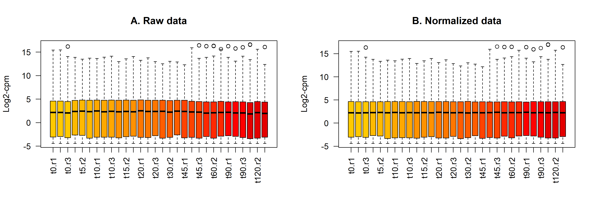

Did you see the difference? (hint: compare the median and the upper
quartile). From now on, we will work with normalized data.

## 4. Data transformation for visualization

Count data has a has a broad spectrum of distribution, from genes with
zero count to genes with thousands.

Plot the following boxplots:

``` r
par(mfrow=c(1,5)) #Figure2
boxplot(dgList$counts, las=2, col=as.matrix(Color), main="")
title(main="A. Original data",ylab="original data")

Log2 <- log2(dgList$counts)
Log2_pseudoCounts <- log2(dgList$counts+1)
cpmCounts <- cpm(dgList, log=TRUE, prior.count = 1)
cpmCounts2 <- cpm(dgList2, log=TRUE, prior.count = 1)

boxplot(Log2, las=2, col=as.matrix(Color), main="")
title(main="B. Orig + Log2 transformation",ylab="Log2")

boxplot(Log2_pseudoCounts, las=2, col=as.matrix(Color), main="")
title(main="C. Orig + Log2(x+1) (pseudoCounts)",ylab="pLog2")

boxplot(cpmCounts, las=2, col=as.matrix(Color), main="")
title(main="D. Orig + cpm with log2 and 0=1",ylab="pLog2(cpm)")

boxplot(cpmCounts2, las=2, col=as.matrix(Color), main="")
title(main="E. Norm + cpm with log2 and 0=1",ylab="pLog2(cpm_norm)")
```


As you can see on panel A, the most datapoints are sticked to the x bar
due that the majority of genes having low count values. A way to “see
all the datapoints” is to apply a data transformation. In panel B, a
log2 transformation was applied. However, since log2 function can’t deal
with “zero” counts, those samples are lost in the graph. This is not a
problem in a boxplot representation but could be a problem for scatter
plots or density plots.

A trick to avoid this issue is to add 1 count to all samples. This is
known as “pseudocount” transformation, which is applied in panel C.

Panel D shows cpm transformation, which is another kind of data
manipulation, where data is divided by the total number of counts and
normalized by 1 million. cpm(x) = (x/sum(x))\*1000000. Then, “only
zeros” are transformed to 1 (0=1) and log2 transformation can be
applied.

We can check the distribution of a specific sample using the *hist*
function;

``` r
par(mfrow=c(1,5))
hist(dgList2$counts[,"t0.r2"],col="lightblue", main="A. Untransf data", ylab="Number of genes")
hist(Log2[,"t0.r2"],col="lightblue", main="B. Log2 transf", ylab="Number of genes")
hist(Log2_pseudoCounts[,"t0.r2"],col="lightblue", main="C. Log2_pseudoCounts", ylab="Number of genes")
hist(cpmCounts[,"t0.r2"],col="lightblue", main="D. cpm+log2+pseudocounts", ylab="Number of genes")
hist(cpmCounts2[,"t0.r2"],col="lightblue", main="E. cpm_norm+log2+pseudocounts", ylab="Number of genes")
```

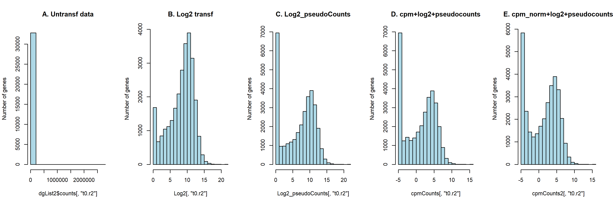

Take a look at the peak at zero, which is lost on the Log2 graph.

## 5. Gene filtering

How many genes are not expressed over all samples?

``` r
kable(table(rowSums(dgList2$counts==0)==30))
```

| Var1  |  Freq |
|:------|------:|
| FALSE | 29768 |
| TRUE  |  3065 |

There are 32,833 genes in this dataset. However, many of them are not
expressed or are not represented by enough reads to contribute to the
analysis. Removing those genes means that we ultimately have fewer tests
to perform, thereby reducing problems associated with multiple testing.

Here, we present two ways to do perform counts filtering.

### 5.1. Manual cutoff

We will retain only those genes that are represented by at least 1 cpm
in at least two samples.

Calculate the cpm

``` r
countsPerMillion <- cpm(dgList2)
```

Let’s compare pre and post cpm for the first sample

``` r
summary(dgList2$counts[,1])
```

    ##    Min. 1st Qu.  Median    Mean 3rd Qu.    Max. 
    ##       0       3     184    1258    1000 1840767

``` r
summary(countsPerMillion[,1]) #first sample (t0.r1)
```

    ##     Min.  1st Qu.   Median     Mean  3rd Qu.     Max. 
    ##     0.00     0.08     4.61    31.55    25.07 46143.64

What’s the difference?… Let’s found what cells of the matrix have a cpm
count above 1

``` r
countCheck <- countsPerMillion > 1
kable(head(countCheck))
```

|           | t0.r1 | t0.r2 | t0.r3 | t5.r1 | t5.r2 | t5.r3 | t10.r1 | t10.r2 | t10.r3 | t15.r1 | t15.r2 | t15.r3 | t20.r1 | t20.r2 | t20.r3 | t30.r1 | t30.r2 | t30.r3 | t45.r1 | t45.r2 | t45.r3 | t60.r1 | t60.r2 | t60.r3 | t90.r1 | t90.r2 | t90.r3 | t120.r1 | t120.r2 | t120.r3 |
|:----------|:------|:------|:------|:------|:------|:------|:-------|:-------|:-------|:-------|:-------|:-------|:-------|:-------|:-------|:-------|:-------|:-------|:-------|:-------|:-------|:-------|:-------|:-------|:-------|:-------|:-------|:--------|:--------|:--------|
| AT1G01010 | TRUE  | TRUE  | TRUE  | TRUE  | TRUE  | TRUE  | TRUE   | TRUE   | TRUE   | TRUE   | TRUE   | TRUE   | TRUE   | TRUE   | TRUE   | TRUE   | TRUE   | TRUE   | TRUE   | TRUE   | TRUE   | TRUE   | TRUE   | TRUE   | TRUE   | TRUE   | TRUE   | TRUE    | TRUE    | TRUE    |
| AT1G01020 | TRUE  | TRUE  | TRUE  | TRUE  | TRUE  | TRUE  | TRUE   | TRUE   | TRUE   | TRUE   | TRUE   | TRUE   | TRUE   | TRUE   | TRUE   | TRUE   | TRUE   | TRUE   | TRUE   | TRUE   | TRUE   | TRUE   | TRUE   | TRUE   | TRUE   | TRUE   | TRUE   | TRUE    | TRUE    | TRUE    |
| AT1G03987 | FALSE | FALSE | FALSE | FALSE | FALSE | FALSE | FALSE  | FALSE  | FALSE  | FALSE  | FALSE  | FALSE  | FALSE  | FALSE  | FALSE  | FALSE  | FALSE  | FALSE  | FALSE  | FALSE  | FALSE  | FALSE  | FALSE  | FALSE  | FALSE  | FALSE  | FALSE  | FALSE   | FALSE   | FALSE   |
| AT1G01030 | TRUE  | TRUE  | TRUE  | TRUE  | TRUE  | TRUE  | TRUE   | TRUE   | TRUE   | TRUE   | TRUE   | TRUE   | TRUE   | TRUE   | TRUE   | TRUE   | TRUE   | TRUE   | TRUE   | TRUE   | TRUE   | TRUE   | TRUE   | TRUE   | TRUE   | TRUE   | TRUE   | TRUE    | TRUE    | TRUE    |
| AT1G01040 | TRUE  | TRUE  | TRUE  | TRUE  | TRUE  | TRUE  | TRUE   | TRUE   | TRUE   | TRUE   | TRUE   | TRUE   | TRUE   | TRUE   | TRUE   | TRUE   | TRUE   | TRUE   | TRUE   | TRUE   | TRUE   | TRUE   | TRUE   | TRUE   | TRUE   | TRUE   | TRUE   | TRUE    | TRUE    | TRUE    |
| AT1G03993 | TRUE  | TRUE  | TRUE  | TRUE  | TRUE  | TRUE  | TRUE   | TRUE   | TRUE   | TRUE   | TRUE   | TRUE   | TRUE   | TRUE   | TRUE   | TRUE   | TRUE   | TRUE   | TRUE   | TRUE   | TRUE   | TRUE   | TRUE   | TRUE   | TRUE   | TRUE   | TRUE   | TRUE    | TRUE    | TRUE    |

Now, sum the “TRUE” values across rows to keep only the ones where at
least 2 cells have 1 cpm value

``` r
keep <- which(rowSums(countCheck) >= 2) # over 1 cpm
str(keep)
```

    ##  Named int [1:22043] 1 2 4 5 6 7 8 10 11 13 ...
    ##  - attr(*, "names")= chr [1:22043] "AT1G01010" "AT1G01020" "AT1G01030" "AT1G01040" ...

There are 22,043 genes that meet our requeriments

Apply the filter to the normalized edgeR table and save the result to a
new edgeR object

``` r
dgList3 <- dgList2[keep,, keep.lib.sizes=FALSE]
```

Compare the dimensions of original and filtered edgeR data:

``` r
dim(dgList2)
```

    ## [1] 32833    30

``` r
dim(dgList3)
```

    ## [1] 22043    30

Now, let’s compare all samples pre and post filtering with a density
plot. The following lines produce a density of log-CPM values for (A)
raw pre-filtered data and (B) post-filtered data for each sample.

Dotted vertical lines mark the log-CPM threshold that we use (cpm \>1).
Samples are colored by time as it is represented on the legend.

``` r
nsamples <- ncol(dgList)
lcpm.cutoff1 <- log2(1)
```

``` r
par(mfrow=c(1,2))

z <- cpm(dgList, log=TRUE, prior.count=1)
plot(density(z[,1]), col=Color, lwd=2, ylim=c(0,0.26), las=2, main="", xlab="")
title(main="A. Raw data", xlab="Log-cpm")
abline(v=lcpm.cutoff1, lty=3)
for (i in 2:nsamples){
  den <- density(z[,i])
  lines(den$x, den$y, col=Color[i], lwd=2)
}
legend("topright", title="time", unique(as.character(dgList$metadata$Time)), text.col=unique(Color), bty="n")

z <- cpm(dgList3, log=TRUE, prior.count=1)
plot(density(z[,1]), col=Color, lwd=2, ylim=c(0,0.26), las=2, main="", xlab="")
title(main="B. Filtered data (manual)", xlab="Log-cpm")
abline(v=lcpm.cutoff1, lty=3)
for (i in 2:nsamples){
  den <- density(z[,i])
  lines(den$x, den$y, col=Color[i], lwd=2)
}
legend("topright", title="time", unique(as.character(dgList$metadata$Time)), text.col=unique(Color), bty="n")
```

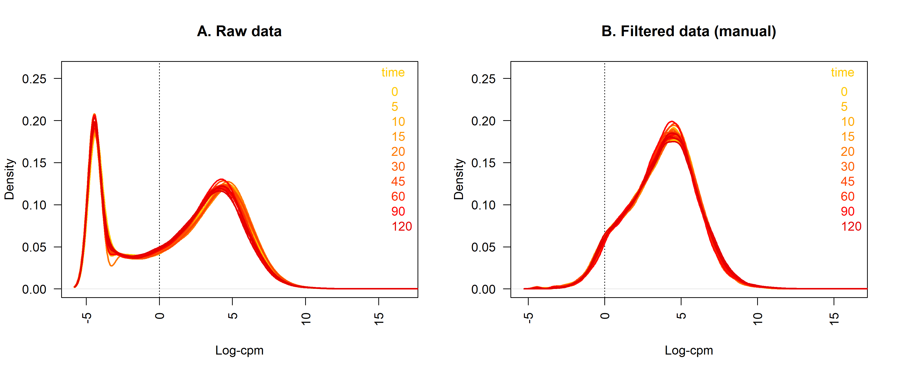

### 5.2. EdgeR cutoff

The filterByExpr function of the edgeR package provides an automatic way
to filter genes while keeping as many genes as possible with worthwhile
counts. By default, the function keeps genes with about 10 read counts
or more in a minimum number of samples, where the number of samples is
chosen according to the minimum group sample size.

More information of the function:

``` r
?filterByExpr
```

Let’s apply the filter gruping samples by time:

``` r
keep.exprs <- filterByExpr(dgList2, group=dgList2$metadata$Time)
dgList4 <- dgList2[keep.exprs,, keep.lib.sizes=FALSE]
```

Compare the dimensions of original, manual filtered and edgeR filtered
data:

``` r
dim(dgList2)
```

    ## [1] 32833    30

``` r
dim(dgList3)
```

    ## [1] 22043    30

``` r
dim(dgList4)
```

    ## [1] 22918    30

Now, let’s compare all samples pre and post filtering with a density
plot. The following lines produce a density of log-CPM values for (A)
raw pre-filtered data and (B) post-filtered data for each sample. Dotted
vertical lines mark the log-CPM threshold (equivalent to a CPM value of
about 0.3) used in the filtering step. The actual filtering uses CPM
values rather than counts in order to avoid giving preference to samples
with large library sizes. For this dataset, the median library size is
about 35 million and 10/35 approx. 0.3, so the filterByExpr function
keeps genes that have a CPM of 0.3 or more in at least three samples.

``` r
L <- mean(dgList$samples$lib.size) * 1e-6 # = 42 million reads
M <- median(dgList$samples$lib.size) * 1e-6 # = 35 million reads
lcpm.cutoff2 <- log2(10/M + 2/L) # cutoff used by filterByExpr function
```

``` r
par(mfrow=c(2,2)) 

z <- cpm(dgList, log=TRUE, prior.count=1)
plot(density(z[,1]), col=Color, lwd=2, ylim=c(0,0.26), las=2, main="", xlab="")
title(main="A. Raw data", xlab="Log-cpm")
abline(v=lcpm.cutoff1, lty=3)
for (i in 2:nsamples){
  den <- density(z[,i])
  lines(den$x, den$y, col=Color[i], lwd=2)
}
legend("topright", title="time", unique(as.character(dgList$metadata$Time)), text.col=unique(Color), bty="n")

z <- cpm(dgList3, log=TRUE, prior.count=1)
plot(density(z[,1]), col=Color, lwd=2, ylim=c(0,0.26), las=2, main="", xlab="")
title(main="B. Filtered data (manual)", xlab="Log-cpm")
abline(v=lcpm.cutoff1, lty=3)
for (i in 2:nsamples){
  den <- density(z[,i])
  lines(den$x, den$y, col=Color[i], lwd=2)
}
legend("topright", title="time", unique(as.character(dgList$metadata$Time)), text.col=unique(Color), bty="n")

#---

z <- cpm(dgList, log=TRUE, prior.count=1)
plot(density(z[,1]), col=Color, lwd=2, ylim=c(0,0.26), las=2, main="", xlab="")
title(main="C. Raw data", xlab="Log-cpm")
abline(v=lcpm.cutoff2, lty=3)
for (i in 2:nsamples){
  den <- density(z[,i])
  lines(den$x, den$y, col=Color[i], lwd=2)
}
legend("topright", title="time", unique(as.character(dgList$metadata$Time)), text.col=unique(Color), bty="n")

z <- cpm(dgList4, log=TRUE, prior.count=1)
plot(density(z[,1]), col=Color, lwd=2, ylim=c(0,0.26), las=2, main="", xlab="")
title(main="D. Filtered data (edgeR)", xlab="Log-cpm")
abline(v=lcpm.cutoff2, lty=3)
for (i in 2:nsamples){
  den <- density(z[,i])
  lines(den$x, den$y, col=Color[i], lwd=2)
}
legend("topright", title="time", unique(as.character(dgList$metadata$Time)), text.col=unique(Color), bty="n")
```

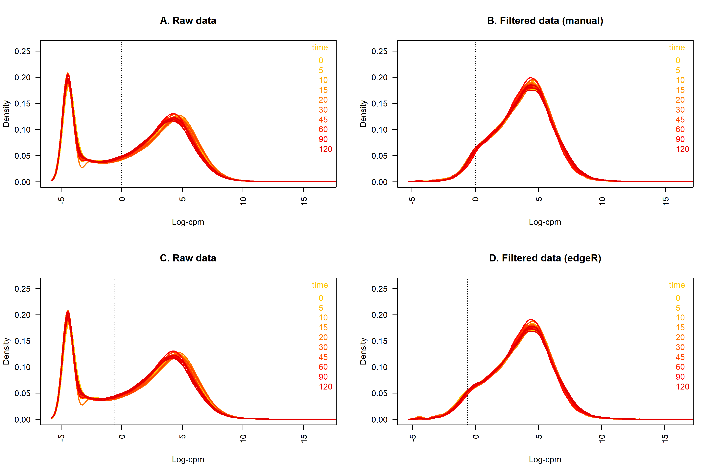

## 6. Data Exploration

### 6.1. edgeR MDS

We can examine inter-sample relationships by producing a plot based on
multidimensional scaling. More details of this kind of exploration on
Session 3… this is just an example. When an object of type DGEList is
the input of plotMDS function, the real called function is a modified
version designed by edgeR team with real name “plotMDS.DGEList”. It
convert the counts to log-cpm and pass these to the limma plotMDS
function. There, distance between each pair of samples (columns) is the
root-mean-square deviation (Euclidean distance) for the top genes.

Distances on the plot can be interpreted as leading log2-fold-change,
meaning the typical (root-mean-square) log2-fold-change between the
samples for the genes that distinguish those samples.

More information about this functions:

``` r
?plotMDS.DGEList
?plotMDS
```

``` r
par(mfrow=c(1,2))  #Figure6
dgMDS <- plotMDS(dgList3, prior.count=1, xlab = "dim1", ylab="dim2", plot = TRUE)
title(main="A. MDS plot")
plotMDS(dgList3, prior.count=1, col=Color, labels=dgList$metadata$Time, xlab = "dim1", ylab="dim2")
title(main="B. Setting colors and labels")
```

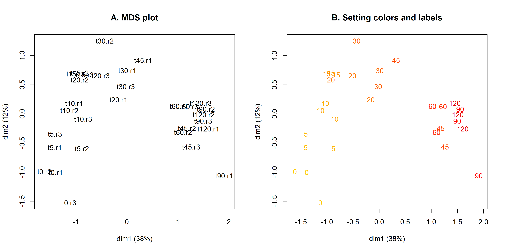

On panel A you see the samples ordination in MDS space. Did you see time
groups?

“Labels” in panel B comes from “Time” column of metadata table  
“Colors” in panel B comes from “Color” column of metadata table

### 6.2. Clustering analysis

Another common data exploration technique used is clustering analysis. A
distance is calculated between samples based on some combination of
variable and a distance matrix generated. A clustering algorithm is then
run over the distance matrix that aggregates/groups samples based on
their distance. There are several clustering methods and several
clustering packages available in R. Of particular use in this context
are the heirarchical clustering functions hclust() available as a base R
function and pvclust() available in the pvclust package (Suzuki and
Shimodaira, 2006). The advantage with the pvclust() function is it uses
bootstrapping to provide a level of confidence that the observed
clusters are robust to slight changes in the samples.

#### 6.2.1. Clustering with hclust() function

More details here:
<https://2-bitbio.com/2017/04/clustering-rnaseq-data-making-heatmaps.html>

First, data as cpm:

``` r
cpmCounts <- cpm(dgList3, log=TRUE, prior.count=1)
cpmCounts <- cpmCounts[complete.cases(cpmCounts),] # no missing values
```

Samples clustering (columns of the matrix)

``` r
hc <- hclust(as.dist(1-cor(cpmCounts, method="pearson")), method="average")
```

Let’s plot the sample’s dendogram

``` r
TreeC = as.dendrogram(hc, method="average")
plot(TreeC,
     main = "Sample's Clustering",
     ylab = "Height")
```


We can select a tree “level” to obtain clusters. For example, at eight
0.06 we will obtain 3 clusters

``` r
TreeC = as.dendrogram(hc, method="average")
plot(TreeC,
     main = "Sample's Clustering",
     ylab = "Height")
abline(h=0.04, lwd=2, col="pink") # 0.05=2groups, 0.04=3groups, 0.03=4groups
```


This is the commmand to cut the tree and save clusters

``` r
group <- as.factor(cutree(hc, h=0.04)) # 0.05=2groups, 0.04=3groups, 0.03=4groups
```

Number of clusters

``` r
levels(group)
```

    ## [1] "1" "2" "3"

And this clustering information could be used to enrich PCA plots (next
Sesion)

We have clusters, but without statistical confidence we can’t do a
credible observation.

#### 6.2.2. Clustering with pvclust() function

This method calculates p-values for hierarchical clustering via
multiscale bootstrap resampling. Hierarchical clustering is done for
given data and p-values are computed for each of the clusters.

More info about pvclust:

``` r
?pvclust
```

On this variable we will set the bootstrap value. You can set it to 10
for a quick result, but change it to 100 or even 1000 for the final
figure (and meanwhile go for a coffee cup).

``` r
bootstrap <- 100
set.seed(123) # Set the seed of R‘s random number generator, which is useful for creating reproducible simulations or random objects.
pv <- pvclust(cpm(dgList3, log=TRUE, prior.count=1), method.dist="cor", method.hclust="average", nboot=bootstrap)
```

    ## Bootstrap (r = 0.5)... Done.
    ## Bootstrap (r = 0.6)... Done.
    ## Bootstrap (r = 0.7)... Done.
    ## Bootstrap (r = 0.8)... Done.
    ## Bootstrap (r = 0.9)... Done.
    ## Bootstrap (r = 1.0)... Done.
    ## Bootstrap (r = 1.1)... Done.
    ## Bootstrap (r = 1.2)... Done.
    ## Bootstrap (r = 1.3)... Done.
    ## Bootstrap (r = 1.4)... Done.

This variable is to set the number’s colors of the plot

``` r
pvcolors <- c(si=4,au=2,bp=4,edge=8)
```

The cluster plot:

``` r
plot(pv,print.num=FALSE, col.pv=pvcolors, cex.pv=0.8, main=paste("Cluster dendogram with 'Approximately Unbiased' values (%), bootstrap=", bootstrap))
```

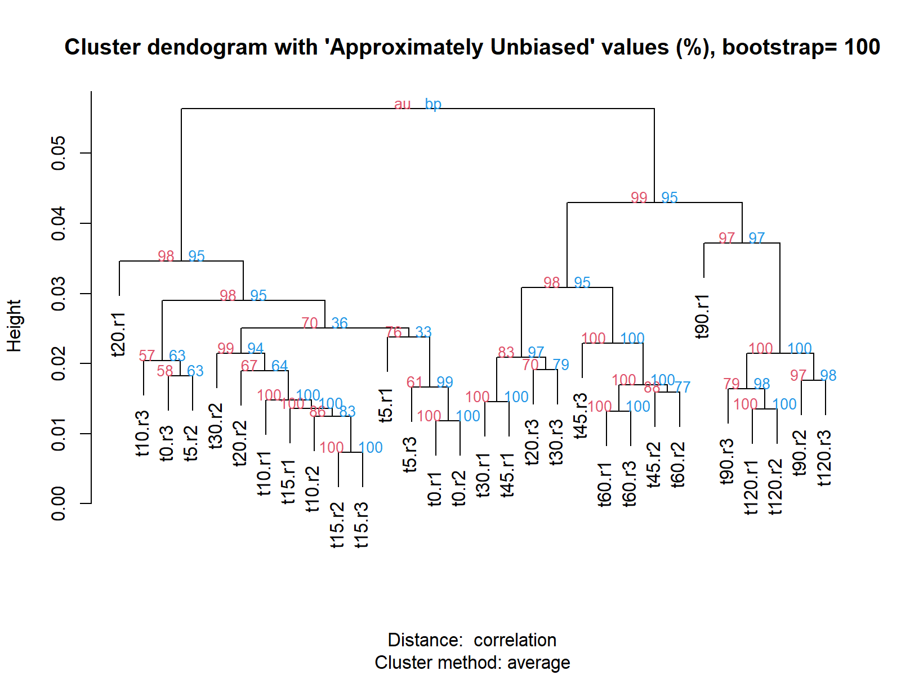

The cluster plot selecting groups according to a specific alpha value

``` r
plot(pv,print.num=FALSE, col.pv=pvcolors, cex.pv=0.8, main=paste("Cluster dendogram with 'Approximately Unbiased' values (%), bootstrap=", bootstrap))
pvrect(pv, alpha=0.90, pv="au", type="geq", max.only=TRUE)
```

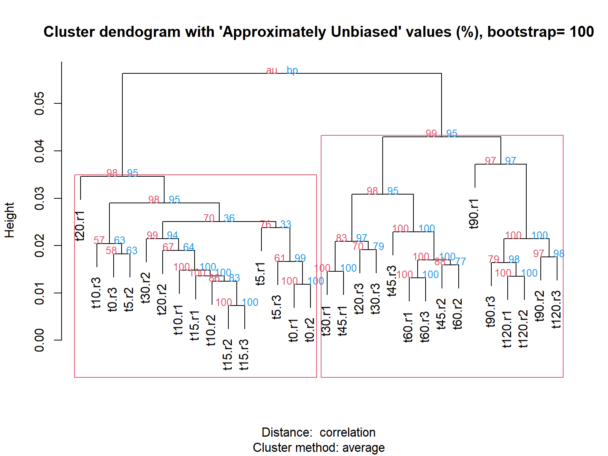

Graph explanation: Two types of values are provided for the confidence
of the nodes: AU (Approximately Unbiased) values and BP (Bootstrap
Probability) values. In both cases, higher is more confident so not to
be confused with conventional p-values. The AU value is computed by
multiscale bootstrap resampling and is a better approximation to
unbiased p-value than BP value computed by normal bootstrap resampling.
Red values are AU p-values, and blue values are BP values. Clusters with
AU larger than 90% are highlighted by rectangles, which are strongly
supported by data.

With the following command we can select the “significant” clusters and
use them in further analysis.

``` r
group <- pvpick(pv, alpha=0.90, pv="au", type="geq", max.only=TRUE)
group$clusters
```

    ## [[1]]
    ##  [1] "t0.r1"  "t0.r2"  "t0.r3"  "t5.r1"  "t5.r2"  "t5.r3"  "t10.r1" "t10.r2"
    ##  [9] "t10.r3" "t15.r1" "t15.r2" "t15.r3" "t20.r1" "t20.r2" "t30.r2"
    ## 
    ## [[2]]
    ##  [1] "t20.r3"  "t30.r1"  "t30.r3"  "t45.r1"  "t45.r2"  "t45.r3"  "t60.r1" 
    ##  [8] "t60.r2"  "t60.r3"  "t90.r1"  "t90.r2"  "t90.r3"  "t120.r1" "t120.r2"
    ## [15] "t120.r3"

#### 6.2.3. Model based clustering

The traditional clustering methods, such as hierarchical clustering and
k-means clustering, are heuristic and are not based on formal models.
Furthermore, k-means algorithm is commonly randomnly initialized, so
different runs of k-means will often yield different results.
Additionally, k-means requires the user to specify the the optimal
number of clusters.

Clustering algorithms can also be developed based on probability models,
such as the finite mixture model for probability densities. The word
model is usually used to represent the type of constraints and geometric
properties of the covariance matrices (Martinez and Martinez, 2005). In
the family of model-based clustering algorithms, one uses certain models
for clusters and tries to optimize the fit between the data and the
models. In the model-based clustering approach, the data are viewed as
coming from a mixture of probability distributions, each of which
represents a different cluster. In other words, in model-based
clustering, it is assumed that the data are generated by a mixture of
probability distributions in which each component represents a different
cluster. Thus a particular clustering method can be expected to work
well when the data conform to the model. Read More:
<https://epubs.siam.org/doi/abs/10.1137/1.9780898718348.ch14?mobileUi=0&>
<https://www.datanovia.com/en/lessons/model-based-clustering-essentials/>

Here we choose a model-based clustering with Mclust of the package
mclust.

``` r
?mclust
```

This method needs a lot of resources so, the recommendation is to use a
subset of the data. For instance, we could choose a random subset or
choose genes withthe highest expression variability over samples.

Use this variable to set the subset length

``` r
numberRows <- 1000
```

Option1: Random selection of “numberRows” genes

``` r
cpmCounts_subset.random <- cpmCounts[sample(nrow(cpmCounts), numberRows), ]
```

Option2: Selection of genes with the highest expression variation. We
will use the function rowSds to select the top “numberRows” genes.

``` r
orderPositions <- order(rowSds(cpmCounts), decreasing=T)
cpmCounts_subset.Sds <- cpmCounts[orderPositions,][1:numberRows,]
```

> Try both options and compare results)

Now, let’s fit the data to a model using Mclust function

``` r
fit <- Mclust(t(cpmCounts_subset.random), scale.=FALSE)
```

view solution summary… what’s the used model? what it means?

``` r
fit
```

    ## 'Mclust' model object: (VEI,4) 
    ## 
    ## Available components: 
    ##  [1] "call"           "data"           "modelName"      "n"             
    ##  [5] "d"              "G"              "BIC"            "loglik"        
    ##  [9] "df"             "bic"            "icl"            "hypvol"        
    ## [13] "parameters"     "z"              "classification" "uncertainty"

Information about models:

``` r
?mclustModelNames
```

Lookup all the attempted options

``` r
summary(fit$BIC) 
```

    ## Best BIC values:
    ##              VEI,4       EEI,3      VEI,3
    ## BIC      -11771.87 -11904.3498 -11904.926
    ## BIC diff      0.00   -132.4809   -133.057

Models and their score by component

``` r
plot(fit$BIC) 
```


Classification vector that we could use on other plots, like PCA (next
Sesion)

``` r
group = as.factor(fit$classification) # classification vector
```

Number of clusters

``` r
levels(group)
```

    ## [1] "1" "2" "3" "4"

### 6.3. Heatmap of samples correlation using mixOmics package

We can examine inter-sample relationships by producing heatmap of
samples correlation.

There are several functions to do a Heatmaps in R. Here we will use cim
function that comes with the package mixOmics.

First, we need to calculate the correlation between sample using the
*cor* function function.

``` r
Log2_pseudoCounts <- log2(dgList3$counts+1)
sampleDists <- as.matrix(cor(Log2_pseudoCounts))
```

Setting a color pallete over red color:

``` r
cimColor <- colorRampPalette(rev(brewer.pal(9, "Reds")))(20)
```

Before to plot the next figure, expand the RStudio plot panel.

> In general, if you receive a “margins too large” message, try to
> expand the RStudio plot panel and use the **dev.off()** command to
> reset the plot device. Then, try again the plot.

> See alternative solutions [on this
> link](https://github.com/jomaldon/tips/blob/master/R-margins_too_large_problem.md)

``` r
cim(sampleDists, color = cimColor, symkey = FALSE, row.cex = 1.3, col.cex = 1.3)
```


What if we use cpm instead of pseudocount?

``` r
cpmCounts <- cpm(dgList3, log=TRUE, prior.count = 1)
sampleDists <- as.matrix(cor(cpmCounts))
```

``` r
cim(sampleDists, color = cimColor, symkey = FALSE, row.cex = 1.3, col.cex = 1.3)
```


Note that sample clustering could be different when using pseudocounts
or cpm. The correlation between samples is sensible to the kind of data
that you use and pseudocounts are different than cpm, as you see on the
panel C and D of the first graph of data transformation section. Some
people do prefer to use pseudocounts but the correct way is to use cpm
(<https://www.biostars.org/p/165619/>).

## 7. Lineal model

Linear modelling in edgeR is carried out using the glmFit (GLM) and
contrasts.fit functions originally written for application to
microarrays. The functions can be used for both microarray and RNA-seq
data and fit a separate model to the expression values for each gene.
Next, empirical Bayes moderation is carried out by borrowing information
across all the genes to obtain more precise estimates of gene-wise
variability (Smyth 2004).

Here, we fit a GLM to account for the time effect.

### 7.1. Creating the model

In our analysis, linear models are fitted to the data with the
assumption that the underlying data is normally distributed. To get
started, a design matrix is set up with both time series information.
This matrix describes the setup of the experiment.

Our dataset have have 30 samples that belongs to 10 “times” with
triplicates, we will use “Time” as the comparison factor.

``` r
design.matrix <- model.matrix(~ dgList3$samples$group)
length(design.matrix[1,]) #10 factors
```

    ## [1] 10

Number of factors

``` r
length(design.matrix[1,]) #10 factors
```

    ## [1] 10

Detail of factors and assigned samples: 30 rows for 30 samples. You can
see a number “1” on the corresponding replicates of each sample. Note
that **dgList3\$samples\$group0** is not present. As a time series, all
factors will be compared against time0.

``` r
design.matrix # factors
```

    ##    (Intercept) dgList3$samples$group5 dgList3$samples$group10
    ## 1            1                      0                       0
    ## 2            1                      0                       0
    ## 3            1                      0                       0
    ## 4            1                      1                       0
    ## 5            1                      1                       0
    ## 6            1                      1                       0
    ## 7            1                      0                       1
    ## 8            1                      0                       1
    ## 9            1                      0                       1
    ## 10           1                      0                       0
    ## 11           1                      0                       0
    ## 12           1                      0                       0
    ## 13           1                      0                       0
    ## 14           1                      0                       0
    ## 15           1                      0                       0
    ## 16           1                      0                       0
    ## 17           1                      0                       0
    ## 18           1                      0                       0
    ## 19           1                      0                       0
    ## 20           1                      0                       0
    ## 21           1                      0                       0
    ## 22           1                      0                       0
    ## 23           1                      0                       0
    ## 24           1                      0                       0
    ## 25           1                      0                       0
    ## 26           1                      0                       0
    ## 27           1                      0                       0
    ## 28           1                      0                       0
    ## 29           1                      0                       0
    ## 30           1                      0                       0
    ##    dgList3$samples$group15 dgList3$samples$group20 dgList3$samples$group30
    ## 1                        0                       0                       0
    ## 2                        0                       0                       0
    ## 3                        0                       0                       0
    ## 4                        0                       0                       0
    ## 5                        0                       0                       0
    ## 6                        0                       0                       0
    ## 7                        0                       0                       0
    ## 8                        0                       0                       0
    ## 9                        0                       0                       0
    ## 10                       1                       0                       0
    ## 11                       1                       0                       0
    ## 12                       1                       0                       0
    ## 13                       0                       1                       0
    ## 14                       0                       1                       0
    ## 15                       0                       1                       0
    ## 16                       0                       0                       1
    ## 17                       0                       0                       1
    ## 18                       0                       0                       1
    ## 19                       0                       0                       0
    ## 20                       0                       0                       0
    ## 21                       0                       0                       0
    ## 22                       0                       0                       0
    ## 23                       0                       0                       0
    ## 24                       0                       0                       0
    ## 25                       0                       0                       0
    ## 26                       0                       0                       0
    ## 27                       0                       0                       0
    ## 28                       0                       0                       0
    ## 29                       0                       0                       0
    ## 30                       0                       0                       0
    ##    dgList3$samples$group45 dgList3$samples$group60 dgList3$samples$group90
    ## 1                        0                       0                       0
    ## 2                        0                       0                       0
    ## 3                        0                       0                       0
    ## 4                        0                       0                       0
    ## 5                        0                       0                       0
    ## 6                        0                       0                       0
    ## 7                        0                       0                       0
    ## 8                        0                       0                       0
    ## 9                        0                       0                       0
    ## 10                       0                       0                       0
    ## 11                       0                       0                       0
    ## 12                       0                       0                       0
    ## 13                       0                       0                       0
    ## 14                       0                       0                       0
    ## 15                       0                       0                       0
    ## 16                       0                       0                       0
    ## 17                       0                       0                       0
    ## 18                       0                       0                       0
    ## 19                       1                       0                       0
    ## 20                       1                       0                       0
    ## 21                       1                       0                       0
    ## 22                       0                       1                       0
    ## 23                       0                       1                       0
    ## 24                       0                       1                       0
    ## 25                       0                       0                       1
    ## 26                       0                       0                       1
    ## 27                       0                       0                       1
    ## 28                       0                       0                       0
    ## 29                       0                       0                       0
    ## 30                       0                       0                       0
    ##    dgList3$samples$group120
    ## 1                         0
    ## 2                         0
    ## 3                         0
    ## 4                         0
    ## 5                         0
    ## 6                         0
    ## 7                         0
    ## 8                         0
    ## 9                         0
    ## 10                        0
    ## 11                        0
    ## 12                        0
    ## 13                        0
    ## 14                        0
    ## 15                        0
    ## 16                        0
    ## 17                        0
    ## 18                        0
    ## 19                        0
    ## 20                        0
    ## 21                        0
    ## 22                        0
    ## 23                        0
    ## 24                        0
    ## 25                        0
    ## 26                        0
    ## 27                        0
    ## 28                        1
    ## 29                        1
    ## 30                        1
    ## attr(,"assign")
    ##  [1] 0 1 1 1 1 1 1 1 1 1
    ## attr(,"contrasts")
    ## attr(,"contrasts")$`dgList3$samples$group`
    ## [1] "contr.treatment"

Another model option is to use **model.matrix(0\~ +
dgList3\$samples\$group)**, but that’s not a time series analysis.
That’s a matrix for paired comparisons (ie, control vs treatment) like
will be used on next Session.

A key strength of limma’s linear modelling approach, is the ability
accommodate arbitrary experimental complexity. Simple designs, such cell
type and batch, through to more complicated factorial designs and models
with interaction terms can be handled relatively easily. Where
experimental or technical effects can be modelled using a random effect,
another possibility in limma is to estimate correlations using
duplicateCorrelation by specifying a block argument for both this
function and in the lmFit linear modelling step.

### 7.2. Estimating dispersions

We need to estimate the dispersion parameter for our negative binomial
model. If there are only a few samples, it is difficult to estimate the
dispersion accurately for each gene, and so we need a way of’sharing’
information between genes. Possible solutions include: - Using a common
estimate across all genes. - Fitting an estimate based on the
mean-variance trend across the dataset, such that genes with similar
abundances have similar variance estimates (trended dispersion). -
Computing a genewise dispersion (tagwise dispersion)

In edgeR, we use an empirical Bayes method to ‘shrink’ the genewise
dispersion estimates towards the common dispersion (tagwise dispersion).
Note that either the common or trended dispersion needs to be estimated
before we can estimate the tagwise dispersion.

``` r
dgList3a <- estimateGLMCommonDisp(dgList3, design=design.matrix)
dgList3a <- estimateGLMTrendedDisp(dgList3a, design=design.matrix)
dgList3a <- estimateGLMTagwiseDisp(dgList3a, design=design.matrix)
```

We can plot the estimates and see how they differ. The biological
coefficient of variation (BCV) is the square root of the dispersion
parameter in the negative binomial model.

``` r
plotBCV(dgList3a)
```

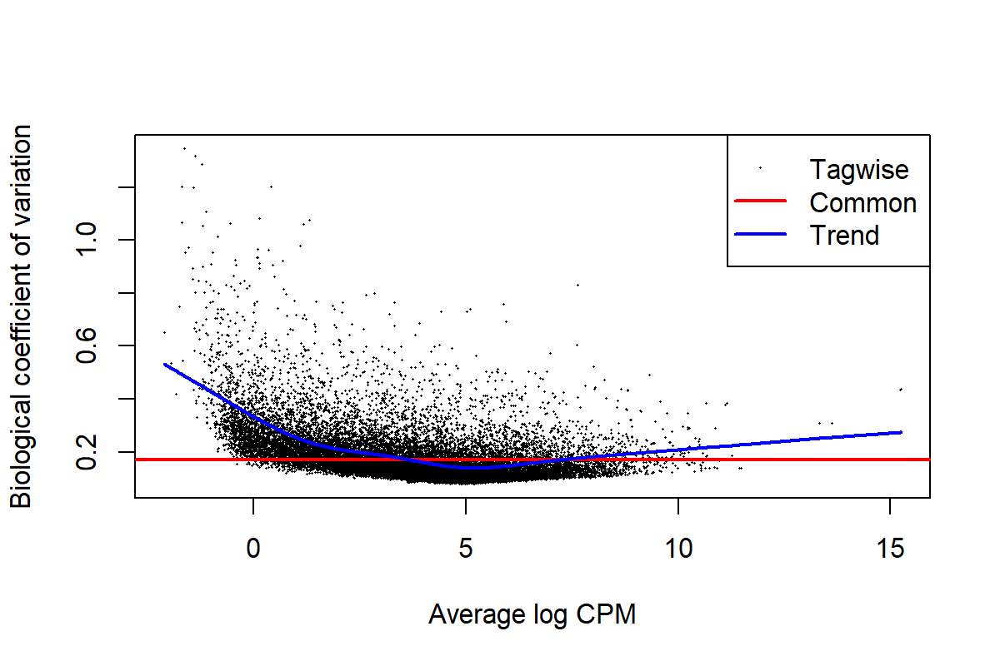

There is a function in EdgeR that merges the three previous commands
but, the result is not the same therefore, we prefer the three step
method. “The estimateDisp function doesn’t give exactly the same
estimates as the traditional calling sequences”.

``` r
dgList3b <- estimateDisp(dgList3, design.matrix,trend.method="locfit")
```

``` r
par(mfrow=c(1,2))
plotBCV(dgList3a)
title(main="A. three steps")
plotBCV(dgList3b)
title(main="B. one step")
```

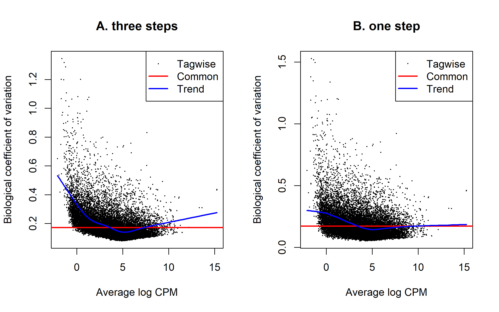

The trend is more realistic using “three steps” method. Finally, we
choose to follow using that result

``` r
dgList3 <- dgList3a
```

### 7.3. Fitting and making comparisons

Now, we can use edgeR as a GLM. First fit the data to the count model
before making contrasts of interest.

``` r
fit <- glmFit(dgList3, design.matrix)
fit$method
```

    ## [1] "oneway"

Let’s see the coefficients of this model as derived from the design
matrix (colnames of table):

``` r
colnames(fit) # factors
```

    ##  [1] "(Intercept)"              "dgList3$samples$group5"  
    ##  [3] "dgList3$samples$group10"  "dgList3$samples$group15" 
    ##  [5] "dgList3$samples$group20"  "dgList3$samples$group30" 
    ##  [7] "dgList3$samples$group45"  "dgList3$samples$group60" 
    ##  [9] "dgList3$samples$group90"  "dgList3$samples$group120"

Then, tests can be performed with a log-ratio test (function glmRT). For
instance, to test differential genes between “time 30” and “time 0”,
this is equivalent to testing the nullity of the sixth coefficient (see
the design matrix, section 8.1). This would then ask the question, “Is
there an effect of **time30** on a given gene?”

``` r
lrt <- glmLRT(fit,coef=6)
#kable(head(lrt$table))
head(lrt$table)
```

    ##                 logFC   logCPM        LR      PValue
    ## AT1G01010 -0.20269543 4.364648 1.1971494 0.273892175
    ## AT1G01020  0.03395948 3.715033 0.0418573 0.837892034
    ## AT1G01030 -0.22378394 1.600086 0.8706772 0.350767902
    ## AT1G01040 -0.17801700 6.456768 2.1048363 0.146834058
    ## AT1G03993 -0.82925789 2.611007 7.4577237 0.006316483
    ## AT1G01046 -0.10140918 0.460144 0.1350681 0.713234064

This result does not have FDR correction The following lines will add
this correction using the function topTags

``` r
lrtFDR <- topTags(lrt, n = nrow(dgList3$counts))
#kable(head(lrtFDR$table)) 
head(lrtFDR$table) 
```

    ##               genes    logFC   logCPM       LR        PValue           FDR
    ## AT3G49940 AT3G49940 7.728044 6.307248 647.1987 9.085399e-143 2.002695e-138
    ## AT5G40850 AT5G40850 5.227322 9.356018 463.3982 8.757614e-103  9.652204e-99
    ## AT4G37540 AT4G37540 8.859143 3.832665 425.8107  1.326505e-94  9.746718e-91
    ## AT5G63160 AT5G63160 4.450219 4.399648 424.1128  3.106399e-94  1.711859e-90
    ## AT5G67420 AT5G67420 6.640411 7.654433 395.7232  4.698470e-88  2.071367e-84
    ## AT1G68670 AT1G68670 5.142652 4.610942 390.7059  5.810373e-87  2.134634e-83

Now we included FDR correction :)

We want to keep only gene with significant expression difference across
time so, we could filter our data with a 2X fold of change cutoff and a
FDR \< 0.05 or less. Some people only use the FDR cutoff but, that’s
only a numerical significance… a confidence that two numbers are
sufficiently different considering a distribution model. However, an
important concept to keep in mind is the biological significance: having
twice the concentration of transcripts (2X) is a starting point to
filter out genes without a real impact on the phenotype. Of course,
there are some genes that with low increments will produce big changes.
My advice is to fisrt evaluate final numbers of selected genes with the
standard cutoff. This because downstream analysis don’t work well with
big numbers. You would like to work with a subset of the data (hundreds
to several thousands), not all the genes.

``` r
selectedLRT.list <- lrtFDR$table$FDR < 0.05 & abs(lrtFDR$table$logFC) > 1
selectedLRT <- lrtFDR$table[selectedLRT.list, ]
nrow(selectedLRT)
```

    ## [1] 1056

“selectedLRT” is the list of genes with a expression pattern on “time
30” that differ from the linear model.

The following are the number of genes calculated for each coeficient of
the design matrix and what they represent.

1 22043 \# Intercept  
2 86 \# time 5  
3 220 \# time 10  
4 533 \# time 15  
5 654 \# time 20  
6 1056 \# time 30  
7 2208 \# time 45  
8 1886 \# time 60  
9 3471 \# time 90  
10 3313 \# time 120

Other options to choose are a mix of factors (times).  
For example, from factor 2 to factor 10 (time 5 to time 120): This would
then ask the question, “Is there an effect of **time** on a given gene?”

``` r
lrt210 <- glmLRT(fit,2:10)
```

``` r
lrt210FDR <- topTags(lrt210, n = nrow(dgList3$counts)) # adds FDR correction
```

``` r
selectedLRT210 <- lrt210FDR$table$FDR < 0.05
selectedLRT210 <- lrt210FDR$table[selectedLRT210, ]
nrow(selectedLRT210)
```

    ## [1] 12185

Now, we can explore expression of selected DE genes of factor 6 using
different plots.

#### 7.3.1. MA plot of selected genes

``` r
plotSmear(lrt, de.tags = rownames(selectedLRT))
abline(h=c(-1, 1), col=2)
```

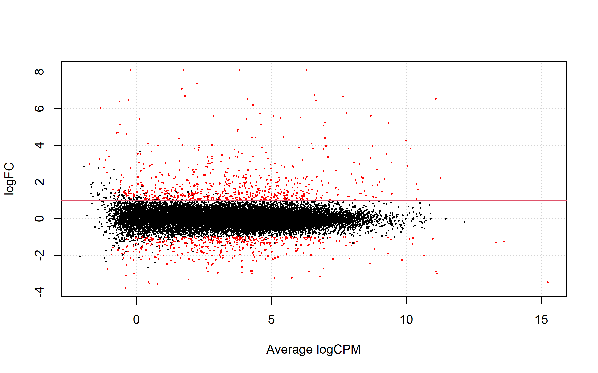

#### 7.3.2. Volcano plot of selected genes

``` r
volcanoData <- cbind(lrtFDR$table$logFC, -log10(lrtFDR$table$FDR))
colnames(volcanoData) <- c("logFC", "negLogPval")
point.col <- ifelse(selectedLRT.list, "red", "black")
plot(volcanoData, pch = 16, col = point.col, cex = 0.5)
abline(v=c(-1, 1), col=2)
abline(h=-log10(0.05), col=2)
```

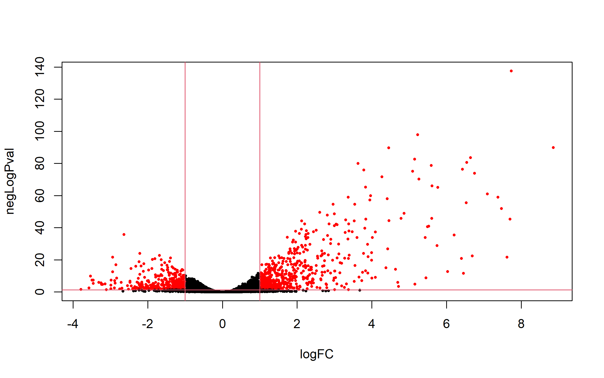

#### 7.3.3. Heatmap of selected genes using cpm

Selecting the subset

``` r
cpmCounts.select <- cpmCounts[match(rownames(selectedLRT), rownames(dgList3$counts)), ]
```

Ploting a heatmap of selected genes with “Samples as rows”

``` r
finalHMr <- cim(t(cpmCounts.select), color = cimColor, symkey = FALSE, row.cex = 1,
               col.cex = 0.7)
```


Ploting a heatmap with “Samples as columns”

``` r
finalHMc <- cim(cpmCounts.select, color = cimColor, symkey = FALSE, row.cex = 0.7,
               col.cex = 1.5)
```


#### 7.3.4. Some other heatmaps schemes

Default heatmap.2 output

``` r
heatmap.2(cpmCounts.select)
```


Scaling by genes (rows)… also known as z-score

``` r
heatmap.2(cpmCounts.select,scale="row", trace="none", cexRow = 0.8,
          keysize = 1, key.title = NA, key.ylab = NA, 
          lmat = matrix(c(4,2,3,1),
            nrow=2,
            ncol=2),
          lhei = c(0.2,0.8),
          lwid = c(0.15,0.85)
)
```


Grouping samples by time with a distintive color

``` r
heatmap.2(cpmCounts.select,scale="row", trace="none", cexRow = 0.8,
          ColSideColors=Color,
          keysize = 1, key.title = NA, key.ylab = NA, 
)
```


More options:

``` r
?heatmap.2
```

### 7.4. Gene clustering of selected genes

In clustering we are interested in whether there are groups of genes or
groups of samples that have similar gene expression patterns. The first
thing that we have to do is to articulate what we mean by similarity or
dissimilarity as expressed by a measure of distance. We can then use
this measure to cluster genes or samples that are similar. Here, we will
use DE genes to generate a set of clusters with similar expression.

#### 7.4.1. Dendogram of genes

You could use any of the methods described in “Clustering analysis”
(Section 6.2)

On this example we will use the “samples dendogram” of the previous
heatmap “finalHMr” (Section 7.3.3)

``` r
plot(finalHMc$ddr, leaflab="none")
```


The tree could be “cutted” at a desired level to obtain clusters. If we
cut at 40%, we will produce 4 clusters

``` r
plot(finalHMc$ddr, leaflab="none")
abline(h=40, lwd=2, col="pink")
```


This is the commmand to cut the tree at the desired level and save
clusters:

``` r
geneClust <- cutree(as.hclust(finalHMc$ddr), h=40) # 50x3 40x4 30x5
```

Number of clusters

``` r
length(unique(geneClust))
```

    ## [1] 4

Listing gene names of cluster 2:

``` r
names(which(geneClust == 2))
```

    ##   [1] "AT5G40850" "AT5G67420" "AT2G15620" "AT1G35560" "AT5G41670" "AT5G09800"
    ##   [7] "AT1G24280" "AT2G22500" "AT4G38340" "AT3G57450" "AT1G30510" "AT1G08657"
    ##  [13] "AT1G77760" "AT5G50200" "AT4G05390" "AT5G13110" "AT2G27510" "AT1G63940"
    ##  [19] "AT1G64190" "AT1G13000" "AT3G28690" "AT1G32920" "AT5G03380" "AT1G71980"
    ##  [25] "AT5G53460" "AT1G70780" "AT3G47520" "AT2G36580" "AT2G40140" "AT4G36020"
    ##  [31] "AT5G54170" "AT1G68550" "AT4G24020" "AT5G12860" "AT5G65010" "AT2G30590"
    ##  [37] "AT2G38170" "AT1G37130" "AT1G70410" "AT1G64140" "AT3G55980" "AT1G63860"
    ##  [43] "AT4G04125" "AT4G02380" "AT1G68840" "AT5G25350" "AT1G29400" "AT1G80325"
    ##  [49] "AT2G29670" "AT1G80310" "AT5G53420" "AT1G43710" "AT5G65310" "AT3G24190"
    ##  [55] "AT5G57660" "AT2G17820" "AT2G24600" "AT3G60750" "AT4G17090" "AT4G18700"
    ##  [61] "AT5G14760" "AT1G25560" "AT2G32680" "AT2G31955" "AT4G05685" "AT1G08477"
    ##  [67] "AT1G21110" "AT2G28890" "AT5G51830" "AT4G17550" "ATMG01390" "AT4G32020"
    ##  [73] "AT1G51805" "AT4G34135" "AT3G17609" "AT2G38470" "AT1G12110" "AT1G62180"
    ##  [79] "ATCG01210" "AT4G30350" "ATCG00920" "AT3G23030" "AT1G54130" "AT1G21120"
    ##  [85] "AT2G36530" "AT4G05320" "AT4G15550" "AT4G24400" "AT4G17770" "AT1G66390"
    ##  [91] "AT3G10420" "AT5G19240" "AT2G37040" "AT3G23920" "AT5G40450" "AT3G16150"
    ##  [97] "AT3G25610" "AT4G11890" "AT4G12290" "ATCG00280" "AT2G01021" "AT4G27260"
    ## [103] "AT1G12940" "AT1G61800" "AT1G74810" "AT4G32940" "AT1G74360" "AT5G57220"
    ## [109] "AT3G28510" "ATMG00020" "ATCG00900" "ATCG00270" "ATCG01240" "AT2G01020"
    ## [115] "AT3G41979" "AT3G06355" "AT1G28290" "AT2G16060" "AT5G42830" "AT4G22495"
    ## [121] "AT4G22505" "AT5G03350" "AT4G22475" "AT4G22467" "AT5G20230" "AT4G22485"
    ## [127] "AT4G22470"

To know the number of genes on each cluster:

``` r
length(names(which(geneClust == 1)))
```

    ## [1] 480

``` r
length(names(which(geneClust == 2)))
```

    ## [1] 127

``` r
length(names(which(geneClust == 3)))
```

    ## [1] 445

``` r
length(names(which(geneClust == 4)))
```

    ## [1] 4

#### 7.4.2. Expression patterns of group of genes

Now, we would like to see the expression pattern of each cluster. We
will use cpm data.

``` r
scaledata <- cpmCounts.select
```

We need a function to obtain the mean expression on each sample of a
desired cluster:

``` r
clust.core = function(i, dat, clusters) {
  ind = (clusters == i)
  colMeans(dat[ind,])
}
```

When we apply the function, there will be obtained core expression of
each cluster

``` r
cores <- sapply(unique(geneClust), clust.core, scaledata, geneClust)
head(cores)
```

    ##           [,1]     [,2]      [,3]     [,4]
    ## t0.r1 3.836735 6.837619 0.4369388 14.38216
    ## t0.r2 3.794091 6.823880 0.3822376 14.53585
    ## t0.r3 3.762711 6.812320 0.4549936 15.22181
    ## t5.r1 3.811902 6.764831 0.3792206 13.26071
    ## t5.r2 3.892364 6.808391 0.5684919 12.94931
    ## t5.r3 3.853511 6.838176 0.3392000 13.07987

Now, we prepare the data frame

``` r
d <- cbind(dgList$metadata$Time,data.frame(cores))
#names <- rownames(d)
#rownames(d) <- NULL
#d <- cbind(names,d)
colnames(d) <-c("time", paste0("clust_",1:ncol(cores)))

#get the data frame into long format for plotting
dmolten <- melt(d, id.vars = "time")
#order by time
dmolten <- dmolten[order(dmolten$time),]
breaks=c(as.numeric(levels(factor(dgList$metadata$Time))))
```

Make the plot:

``` r
p0 <- ggplot(dmolten, aes(time, value, col=variable)) +
  geom_point() +
  geom_line() +
  scale_x_continuous(minor_breaks = NULL, breaks=breaks) +
  xlab("Time") +
  ylab("Expression") +
  labs(title= "Clusters",color = "Cluster")
p0
```


We can select a specific cluster to draw the expression of their genes.
I will select cluster1

**Cluster 1**

Subset the complete data by cluster =1:

``` r
dClust1 <- t(scaledata[geneClust==1,])
# add the time
dClust1 <- data.frame(cbind(data.frame(dgList$metadata$Time),dClust1))
colnames(dClust1)[1] <- "time"
# get the data frame into long format for plotting
dClust1molten <- melt(dClust1, id.vars = "time")
# order by time
dClust1molten <- dClust1molten[order(dClust1molten$time),]
# Subset the cores molten dataframe so we can plot core1
core1 <- dmolten[dmolten$variable=="clust_1",]
```

Now, to plot this gene expression we use the group=variable and change
the geom_line to grey. Then we add on top of expression the mean
expression of the core in blue passing the the core data to geom_line.

``` r
p1 <- ggplot(dClust1molten, aes(time, value, group=variable)) + 
  geom_line(color="grey") +
  geom_point(data=core1, aes(time,value), color="blue") + 
  geom_line(data=core1, aes(time,value), color="blue") +
  scale_x_continuous(minor_breaks = NULL, breaks=breaks) +
  xlab("Time") +
  ylab("Expression") +
  labs(title= "Cluster1", color = "Cluster")
p1
```


**All clusters**

We can do it for all the clusters. The following lines create ggplot
objects p2 to p5, with the expression data of all clusters. Then, all
plots will be joined as an unique plot.

``` r
#Function to create plots
cluster_plot<- function(scaledata, clust){
  dClust <- t(scaledata[geneClust==clust,])
  #add time
  dClust <- data.frame(cbind(data.frame(dgList$metadata$Time),dClust))
  colnames(dClust)[1] <- "time"
  #get the data frame into long format for plotting
  dClustmolten <- melt(dClust, id.vars = "time")
  #order by time
  dClustmolten <- dClustmolten[order(dClustmolten$time),]
  #Subset the cores molten dataframe so we can plot core1
  core <- dmolten[dmolten$variable==paste0("clust_",clust),]

  p <- ggplot(dClustmolten, aes(time,value, group=variable)) + 
  geom_line(color="grey") +
  geom_point(data=core, aes(time,value), color="blue") + 
  geom_line(data=core, aes(time,value), color="blue") +
  scale_x_continuous(minor_breaks = NULL, breaks=c(as.numeric(levels(factor(dmolten$time))))) +
  xlab("Time") +
  ylab("Expression") +
  labs(title= paste0("Cluster",clust),color = paste0("Cluster",clust))
return(p)
}
```

``` r
p2 <- cluster_plot(scaledata, 2)
p3 <- cluster_plot(scaledata, 3)
p4 <- cluster_plot(scaledata, 4)
```

Now, we are ready to plot all clusters:

``` r
# Expand the RStudio plot panel before the plot
grid.arrange(p0 + theme(legend.position = "none"),
             p1+ ylab(NULL),
             p2+ ylab(NULL),
             p3+ ylab(NULL),
             p4+ ylab(NULL),
             ncol=5)
```


Cool, but each graph have their own scale and they are not sorted. Look
for the max and min axes value through the graphs to set global values.

``` r
# Setting min a max limits of y axes based on all five plots
ylim1=-5; ylim2=17
```

Finally, sort the command lines of expression plots according to p0
order and plot!

``` r
# Expand the RStudio plot panel before the plot
grid.arrange(p0 + ylim(ylim1, ylim2) + theme(legend.position = "none"),
             p4 + ylim(ylim1, ylim2) + ylab(NULL), 
             p2 + ylim(ylim1, ylim2) + ylab(NULL), 
             p1 + ylim(ylim1, ylim2) + ylab(NULL), 
             p3 + ylim(ylim1, ylim2) + ylab(NULL), 
             ncol=5)
```


#### 7.4.3. Saving results

Now, you would want to know what functions are represented on this
selected genes. This will be explained on session5.

Meanwhile you can save the gene list of each cluster nor the list of all
clusters to a text file to be ready.

``` r
# Cluster2 of factor6
write.table(names(which(geneClust == 2)), "factor6.clust2.txt", sep="\t", quote = FALSE, row.names = F, col.names = F)

# All genes of factor6
write.table(names(geneClust), "factor6.all.txt", sep="\t", quote = FALSE, row.names = F, col.names = F)
```

## 8. Session info (and data saving)

``` r
sessionInfo()
```

    ## R version 4.2.0 (2022-04-22 ucrt)
    ## Platform: x86_64-w64-mingw32/x64 (64-bit)
    ## Running under: Windows 10 x64 (build 19045)
    ## 
    ## Matrix products: default
    ## 
    ## locale:
    ## [1] LC_COLLATE=Spanish_Chile.utf8  LC_CTYPE=Spanish_Chile.utf8   
    ## [3] LC_MONETARY=Spanish_Chile.utf8 LC_NUMERIC=C                  
    ## [5] LC_TIME=Spanish_Chile.utf8    
    ## 
    ## attached base packages:
    ## [1] stats     graphics  grDevices utils     datasets  methods   base     
    ## 
    ## other attached packages:
    ##  [1] matrixStats_0.62.0 mclust_6.0.0       gplots_3.1.3       reshape2_1.4.4    
    ##  [5] mixOmics_6.20.0    lattice_0.20-45    MASS_7.3-60        RColorBrewer_1.1-3
    ##  [9] gridExtra_2.3      ggplot2_3.4.2      pvclust_2.2-0      dplyr_1.1.2       
    ## [13] knitr_1.42         edgeR_3.38.4       limma_3.52.2      
    ## 
    ## loaded via a namespace (and not attached):
    ##  [1] ggrepel_0.9.3       Rcpp_1.0.9          locfit_1.5-9.6     
    ##  [4] tidyr_1.2.0         corpcor_1.6.10      gtools_3.9.3       
    ##  [7] digest_0.6.29       utf8_1.2.2          RSpectra_0.16-1    
    ## [10] R6_2.5.1            plyr_1.8.8          ellipse_0.4.5      
    ## [13] evaluate_0.21       highr_0.10          pillar_1.9.0       
    ## [16] rlang_1.1.1         Matrix_1.5-4        rmarkdown_2.21     
    ## [19] labeling_0.4.2      splines_4.2.0       rARPACK_0.11-0     
    ## [22] BiocParallel_1.30.3 stringr_1.5.0       igraph_1.4.2       
    ## [25] munsell_0.5.0       compiler_4.2.0      xfun_0.39          
    ## [28] pkgconfig_2.0.3     htmltools_0.5.3     tidyselect_1.2.0   
    ## [31] tibble_3.2.1        codetools_0.2-19    fansi_1.0.3        
    ## [34] withr_2.5.0         bitops_1.0-7        grid_4.2.0         
    ## [37] gtable_0.3.3        lifecycle_1.0.3     magrittr_2.0.3     
    ## [40] scales_1.2.1        KernSmooth_2.23-21  cli_3.6.1          
    ## [43] stringi_1.7.8       farver_2.1.1        generics_0.1.3     
    ## [46] vctrs_0.6.2         tools_4.2.0         glue_1.6.2         
    ## [49] purrr_0.3.4         parallel_4.2.0      fastmap_1.1.0      
    ## [52] yaml_2.3.5          colorspace_2.0-3    caTools_1.18.2

``` r
#save.image(file = "3_Pipeline-Gene_expression_analysis.RData")
```
