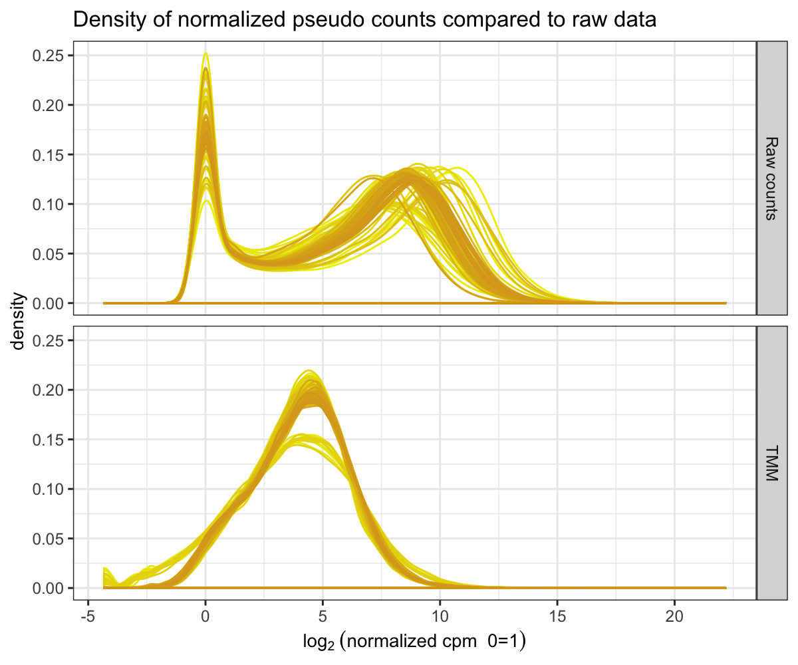
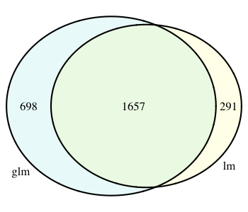
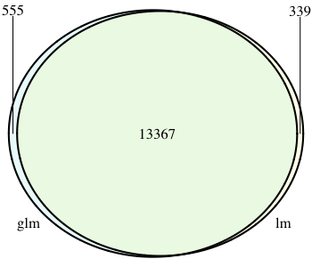
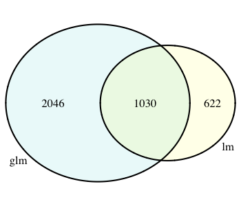

Session 2 | Part 2 : Gene expression analysis, multivariate experiments
================
Pamela Camejo
5/15/2020

### **Watch [this video](https://drive.google.com/file/d/1MT_04vC4c23LWJKTjEdTVf7cYj1YPdZf/view?usp=sharing) for a more detailed explanation of the following pipeline**

During this session, we will discover genes differentially expressed in
the genome of Arabidopsis when considering time, treatment and tissue,
as well as the interaction of these factors.

Open R Studio (or just R) and load the following libraries.

``` r
library(edgeR)
library(knitr)
library(dplyr)
library(reshape2)
library(ggplot2)
require(gridExtra)
library(ComplexHeatmap)
library(circlize)
library(VennDiagram)
```

> Don’t forget to set the folder where you downloaded your files as the
> working directory.

``` r
setwd("~/Documents/IBIO/R workshop/Session2/")
```

### 1\. Importing and formatting data.

Start importing counts table and metadata associated to the samples
(previously downloaded from
[Data](https://github.com/ibioChile/Transcriptomics-R-Workshop/tree/master/Session2-Treatment_and_Multivariate/Data)
folder).

``` r
counts <- read.table("fc0.original.counts.session2-2.txt")
metadata <- read.table("metadata_session2-2.txt", header=TRUE)
kable(head(metadata))
```

| Sample     | Tissue | Treatment | Replicate | Time |
| :--------- | :----- | :-------- | --------: | ---: |
| SRR5440786 | Shoot  | None      |         1 |    0 |
| SRR5440785 | Shoot  | None      |         2 |    0 |
| SRR5440784 | Shoot  | None      |         3 |    0 |
| SRR5440841 | Root   | None      |         1 |    0 |
| SRR5440842 | Root   | None      |         3 |    0 |
| SRR5440843 | Root   | None      |         2 |    0 |

We will fix the header of counts leaving only the sample
ID.

``` r
colnames(counts) <- sapply(strsplit(colnames(counts),".",fixed=TRUE), `[`, 1)
kable(head(counts))
```

|           | SRR5440784 | SRR5440785 | SRR5440786 | SRR5440787 | SRR5440788 | SRR5440789 | SRR5440790 | SRR5440791 | SRR5440792 | SRR5440793 | SRR5440794 | SRR5440795 | SRR5440796 | SRR5440797 | SRR5440798 | SRR5440799 | SRR5440800 | SRR5440801 | SRR5440802 | SRR5440803 | SRR5440804 | SRR5440805 | SRR5440806 | SRR5440807 | SRR5440808 | SRR5440809 | SRR5440810 | SRR5440811 | SRR5440812 | SRR5440813 | SRR5440814 | SRR5440815 | SRR5440816 | SRR5440817 | SRR5440818 | SRR5440819 | SRR5440820 | SRR5440821 | SRR5440822 | SRR5440823 | SRR5440824 | SRR5440825 | SRR5440826 | SRR5440827 | SRR5440828 | SRR5440829 | SRR5440830 | SRR5440831 | SRR5440832 | SRR5440833 | SRR5440834 | SRR5440835 | SRR5440836 | SRR5440837 | SRR5440838 | SRR5440839 | SRR5440840 | SRR5440841 | SRR5440842 | SRR5440843 | SRR5440844 | SRR5440845 | SRR5440846 | SRR5440847 | SRR5440848 | SRR5440849 | SRR5440850 | SRR5440851 | SRR5440852 | SRR5440853 | SRR5440854 | SRR5440855 | SRR5440856 | SRR5440857 | SRR5440858 | SRR5440859 | SRR5440860 | SRR5440861 | SRR5440862 | SRR5440863 | SRR5440864 | SRR5440865 | SRR5440866 | SRR5440867 | SRR5440868 | SRR5440869 | SRR5440870 | SRR5440871 | SRR5440872 | SRR5440873 | SRR5440874 | SRR5440875 | SRR5440876 | SRR5440877 | SRR5440878 | SRR5440879 | SRR5440880 | SRR5440881 | SRR5440882 | SRR5440883 | SRR5440884 | SRR5440885 | SRR5440886 | SRR5440887 | SRR5440888 | SRR5440889 | SRR5440890 | SRR5440891 | SRR5440892 | SRR5440893 | SRR5440894 | SRR5440895 | SRR5440896 | SRR5440897 |
| --------- | ---------: | ---------: | ---------: | ---------: | ---------: | ---------: | ---------: | ---------: | ---------: | ---------: | ---------: | ---------: | ---------: | ---------: | ---------: | ---------: | ---------: | ---------: | ---------: | ---------: | ---------: | ---------: | ---------: | ---------: | ---------: | ---------: | ---------: | ---------: | ---------: | ---------: | ---------: | ---------: | ---------: | ---------: | ---------: | ---------: | ---------: | ---------: | ---------: | ---------: | ---------: | ---------: | ---------: | ---------: | ---------: | ---------: | ---------: | ---------: | ---------: | ---------: | ---------: | ---------: | ---------: | ---------: | ---------: | ---------: | ---------: | ---------: | ---------: | ---------: | ---------: | ---------: | ---------: | ---------: | ---------: | ---------: | ---------: | ---------: | ---------: | ---------: | ---------: | ---------: | ---------: | ---------: | ---------: | ---------: | ---------: | ---------: | ---------: | ---------: | ---------: | ---------: | ---------: | ---------: | ---------: | ---------: | ---------: | ---------: | ---------: | ---------: | ---------: | ---------: | ---------: | ---------: | ---------: | ---------: | ---------: | ---------: | ---------: | ---------: | ---------: | ---------: | ---------: | ---------: | ---------: | ---------: | ---------: | ---------: | ---------: | ---------: | ---------: | ---------: | ---------: | ---------: |
| AT1G01010 |       1040 |       1512 |       1162 |        373 |        587 |        157 |        588 |        339 |        508 |        458 |        615 |        568 |        258 |        355 |        412 |        555 |        261 |        643 |        699 |          0 |        692 |        384 |        373 |        268 |        445 |        321 |        548 |        556 |        423 |        475 |        517 |        379 |        440 |        279 |        384 |        362 |        421 |        221 |        265 |        339 |        406 |        597 |        394 |        367 |        263 |        307 |        379 |        283 |        369 |        296 |        588 |        258 |        383 |        265 |        400 |        199 |        487 |       2697 |       2746 |       1650 |        784 |        333 |        595 |       1278 |       1084 |        960 |        901 |       1296 |        842 |        702 |        791 |        384 |        698 |       1220 |       1064 |        390 |       1033 |        979 |        927 |        599 |        585 |        961 |        944 |        922 |        937 |        843 |        903 |       1081 |        471 |        216 |        641 |       1015 |        428 |        739 |        667 |       1393 |        868 |        508 |        258 |        867 |        614 |        596 |        631 |        779 |        869 |       1234 |        459 |        271 |        653 |        609 |        525 |        475 |        586 |       1851 |
| AT1G01020 |        376 |        722 |        679 |        215 |        180 |         64 |        162 |        157 |        249 |        253 |        293 |        226 |        217 |        246 |        172 |        337 |        153 |        267 |        283 |          0 |        240 |        154 |        191 |        195 |        246 |        209 |        186 |        235 |        242 |        220 |        206 |        226 |        213 |        291 |        244 |        224 |        209 |        327 |        260 |        260 |        197 |        368 |        217 |        168 |        171 |        178 |        340 |        277 |        225 |        206 |        282 |        103 |        222 |        243 |        267 |        201 |        370 |       2151 |       1381 |       1226 |        649 |         76 |         75 |        283 |        245 |        233 |        281 |        230 |        130 |        835 |         78 |         29 |        263 |        212 |        281 |         93 |        311 |        209 |        651 |         66 |         41 |        332 |        366 |        277 |        200 |        368 |        335 |        484 |         41 |         24 |        228 |        270 |        179 |        260 |        191 |        666 |        640 |         53 |         21 |        371 |        319 |        425 |        325 |        275 |        435 |        406 |         49 |         25 |        268 |        205 |        299 |        358 |        181 |       1137 |
| AT1G03987 |          1 |          0 |          4 |          1 |          1 |          0 |          1 |          1 |          1 |          1 |          3 |          2 |          1 |          1 |          0 |          1 |          1 |          0 |          0 |          0 |          1 |          0 |          0 |          0 |          0 |          2 |          0 |          0 |          0 |          0 |          0 |          1 |          0 |          1 |          0 |          0 |          0 |          0 |          0 |          0 |          0 |          1 |          1 |          0 |          1 |          0 |          0 |          0 |          0 |          1 |          0 |          0 |          0 |          0 |          0 |          0 |          0 |          0 |          1 |          0 |          0 |          0 |          0 |          0 |          0 |          0 |          0 |          1 |          0 |          0 |          0 |          0 |          0 |          0 |          0 |          0 |          1 |          1 |          0 |          0 |          0 |          0 |          0 |          0 |          0 |          0 |          0 |          1 |          0 |          0 |          0 |          0 |          0 |          0 |          0 |          0 |          1 |          0 |          0 |          0 |          0 |          0 |          0 |          0 |          1 |          0 |          0 |          0 |          0 |          0 |          0 |          0 |          0 |          0 |
| AT1G01030 |        116 |        195 |        179 |         73 |         41 |         15 |         55 |         55 |         60 |         54 |         70 |         81 |         58 |         47 |         49 |         78 |         49 |         56 |         69 |          0 |         69 |         53 |         56 |         59 |         53 |         58 |         55 |         76 |         66 |         62 |         51 |         60 |         55 |         48 |         55 |         37 |         60 |         65 |         45 |         77 |         56 |         81 |         32 |         42 |         32 |         33 |         58 |         49 |         85 |         60 |         78 |         50 |         50 |         37 |         43 |         23 |         61 |        173 |         82 |         94 |         47 |         22 |         30 |         26 |         24 |         17 |         26 |         25 |         12 |         59 |         34 |         23 |         18 |         20 |         25 |          3 |         14 |          9 |         53 |         34 |         24 |         21 |         35 |         24 |         17 |         23 |         17 |         30 |         33 |         11 |         12 |         18 |         12 |         19 |         13 |         38 |         70 |         33 |         30 |         12 |         18 |         21 |         16 |         21 |         23 |         24 |         20 |         22 |         25 |         17 |         18 |         22 |         15 |         73 |
| AT1G01040 |       3931 |       6002 |       5513 |       1482 |       1784 |        532 |       1622 |       1461 |       1800 |       1739 |       2211 |       1855 |       1585 |       1659 |       1446 |       2195 |       1214 |       1805 |       2389 |          0 |       2295 |       1247 |       1415 |       1438 |       1746 |       1519 |       1605 |       1865 |       1908 |       1744 |       1418 |       1503 |       1436 |       1415 |       1787 |       1571 |       2006 |       1340 |       1413 |       1702 |       1382 |       2453 |       1369 |       1388 |       1365 |       1257 |       1622 |       1458 |       1737 |       1384 |       2240 |        983 |       1627 |       1346 |       1833 |       1174 |       2119 |       4606 |       3944 |       3058 |       1555 |       1185 |       1157 |       1320 |       1025 |       1165 |        980 |       1062 |        962 |       1633 |       1567 |       1055 |        850 |       1149 |       1361 |        644 |       1369 |       1222 |       1634 |       1528 |       1290 |       1138 |       1202 |       1219 |       1165 |       1223 |       1364 |       1524 |       1061 |        570 |        847 |        884 |        723 |       1091 |        786 |       1741 |       1336 |       1287 |       1024 |       1123 |       1085 |        883 |       1127 |        964 |       1083 |       1251 |       1054 |        727 |        875 |        860 |        893 |        629 |        780 |       2564 |
| AT1G03993 |        327 |        564 |        513 |        102 |        140 |         32 |         99 |         99 |        151 |        156 |        209 |        142 |        109 |        131 |        116 |        160 |         94 |        169 |        194 |          0 |        188 |         93 |        110 |         82 |        159 |        104 |        154 |        168 |        159 |        143 |         94 |         94 |         81 |         38 |        106 |        109 |        155 |         65 |         82 |        111 |        116 |        182 |         75 |         65 |        122 |         65 |        101 |         98 |        105 |         67 |        151 |         89 |        108 |         73 |        143 |         80 |        195 |        144 |        176 |        105 |         78 |         24 |         50 |         69 |         42 |         93 |         42 |         55 |         94 |        117 |         64 |         66 |         33 |        102 |         74 |         39 |         92 |         92 |         75 |         65 |         63 |         39 |         30 |         69 |         94 |         67 |         69 |         61 |         49 |         20 |         27 |         48 |         44 |         54 |         62 |         57 |         78 |         38 |         90 |         37 |         28 |         31 |         33 |         56 |         41 |         45 |         50 |         27 |         30 |         22 |         49 |         25 |         48 |         89 |

Let’s order samples in metadata by Tissue, Treatment and Time. Then
order samples in counts table according to metadata.

``` r
metadata_s <- metadata %>% arrange(Tissue, desc(Treatment),Time)
counts <- counts[,metadata_s$Sample]
dim(counts)
```

    ## [1] 32833   114

> This table has 114 samples and 32,833 genes.

### 2\. Filter and normalization

We start the analysis by filtering out genes for which no count has been
found.

``` r
counts_filt1 <- counts[rowSums(counts) > 0, ]
dim(counts_filt1)
```

    ## [1] 31520   114

> This leave us with 31,520 genes.

Now, we will create an object of type CountDataSet to carry out
normalization:

``` r
dge <- DGEList(counts_filt1)
```

It is often useful to visualize the count distribution, to compute
“pseudo counts”, which are log-transformed counts. We will store raw
pseudo-counts in a data frame for later use.

``` r
pseudo_counts <- cpm(dge, log=TRUE, prior.count = 1)

df_raw <- melt(t(pseudo_counts), id = rownames(pseudo_counts))
names(df_raw)[1:2]<- c("sample", "id")
df_raw$method <- rep("Raw counts", nrow(df_raw))  
kable(head(df_raw))
```

| sample     | id        |    value | method     |
| :--------- | :-------- | -------: | :--------- |
| SRR5440841 | AT1G01010 | 5.342980 | Raw counts |
| SRR5440842 | AT1G01010 | 5.801006 | Raw counts |
| SRR5440843 | AT1G01010 | 5.475558 | Raw counts |
| SRR5440871 | AT1G01010 | 5.751347 | Raw counts |
| SRR5440880 | AT1G01010 | 5.342107 | Raw counts |
| SRR5440889 | AT1G01010 | 6.030843 | Raw counts |

The object `df_raw` will be used later to compare the effect of
normalization over count distribution in different samples.

We will try TMM normalization and compared to raw data.

``` r
dge1 <- calcNormFactors(dge, method = "TMM")
```

> Try different normalization methods to pick the right one.

Normalized data is then obtained by the function cpm.

``` r
pseudo_TMM <- cpm(dge1, log=TRUE, prior.count = 1)

df_TMM <- melt(t(pseudo_TMM), id = rownames(pseudo_TMM))
names(df_TMM)[1:2]<- c("sample", "id")
df_TMM$method <- rep("TMM", nrow(df_TMM))  
kable(head(df_TMM))
```

| sample     | id        |    value | method |
| :--------- | :-------- | -------: | :----- |
| SRR5440841 | AT1G01010 | 5.114352 | TMM    |
| SRR5440842 | AT1G01010 | 5.575383 | TMM    |
| SRR5440843 | AT1G01010 | 5.198733 | TMM    |
| SRR5440871 | AT1G01010 | 5.509596 | TMM    |
| SRR5440880 | AT1G01010 | 5.140010 | TMM    |
| SRR5440889 | AT1G01010 | 5.776856 | TMM    |

To compare data counts pre and post normalization, we will generate
**boxplots** of each sample with counts distribution.

``` r
df_allnorm <- rbind(df_raw, df_TMM)

p <- ggplot(data=df_allnorm, aes(x=sample, y=value, fill=method)) 
p <- p + geom_boxplot()  
p <- p + theme_bw()
p <- p + ggtitle("Boxplots of normalized pseudo counts compared to raw data")
p <- p + facet_grid(method ~ .) 
p <- p + ylab(expression(log[2] ~ ("normalized cpm  0=1"))) + xlab("")
p <- p + theme(title = element_text(size=10), axis.text.x = element_blank(), 
               axis.ticks.x = element_blank())
print(p)
```


We can see in this plot that one of the samples failed (very low number
of reads). Let’s check the total number of reads obtained by each
sample.

``` r
kable(dge1$samples)
```

|            | group | lib.size | norm.factors |
| ---------- | :---- | -------: | -----------: |
| SRR5440841 | 1     | 66531382 |    1.1719708 |
| SRR5440842 | 1     | 49296798 |    1.1694622 |
| SRR5440843 | 1     | 37125470 |    1.2118170 |
| SRR5440871 | 1     | 20086614 |    1.1826291 |
| SRR5440880 | 1     | 21425377 |    1.1505853 |
| SRR5440889 | 1     | 18888066 |    1.1926758 |
| SRR5440872 | 1     | 13377400 |    0.7897087 |
| SRR5440881 | 1     | 19510143 |    0.7126377 |
| SRR5440890 | 1     | 14415407 |    0.7866260 |
| SRR5440873 | 1     |  8760824 |    0.7807583 |
| SRR5440882 | 1     | 13634398 |    0.6195989 |
| SRR5440891 | 1     | 10762935 |    0.7977657 |
| SRR5440874 | 1     | 11260228 |    1.2048017 |
| SRR5440883 | 1     | 18186964 |    1.1753444 |
| SRR5440892 | 1     | 13783506 |    1.1930051 |
| SRR5440875 | 1     | 18896038 |    1.0821231 |
| SRR5440884 | 1     | 14977241 |    1.1953366 |
| SRR5440893 | 1     | 12371659 |    1.1649193 |
| SRR5440876 | 1     | 11030301 |    1.1400358 |
| SRR5440885 | 1     | 16969968 |    1.1470456 |
| SRR5440894 | 1     | 14318440 |    1.1877228 |
| SRR5440877 | 1     | 16179052 |    1.1556228 |
| SRR5440886 | 1     | 17688223 |    1.1699587 |
| SRR5440895 | 1     | 13706519 |    1.1329010 |
| SRR5440878 | 1     | 13588643 |    1.0604263 |
| SRR5440887 | 1     | 17138450 |    1.0997500 |
| SRR5440896 | 1     | 12396155 |    1.1130383 |
| SRR5440879 | 1     | 30481933 |    1.1367090 |
| SRR5440888 | 1     | 20047058 |    1.1097244 |
| SRR5440897 | 1     | 46426873 |    1.1170803 |
| SRR5440844 | 1     | 19071799 |    1.2051696 |
| SRR5440853 | 1     | 20959544 |    1.1947444 |
| SRR5440862 | 1     | 20955296 |    1.1803211 |
| SRR5440845 | 1     | 18467844 |    0.6134765 |
| SRR5440854 | 1     | 21771005 |    0.7340568 |
| SRR5440863 | 1     | 19081309 |    0.7315164 |
| SRR5440846 | 1     | 17425903 |    0.7577215 |
| SRR5440855 | 1     | 16651880 |    0.5647710 |
| SRR5440864 | 1     | 15648714 |    0.7799345 |
| SRR5440847 | 1     | 19082641 |    1.1647384 |
| SRR5440856 | 1     | 13127631 |    1.1727406 |
| SRR5440865 | 1     | 17010790 |    1.2030063 |
| SRR5440848 | 1     | 16468090 |    1.1255107 |
| SRR5440857 | 1     | 20623181 |    1.0830334 |
| SRR5440866 | 1     | 16676038 |    1.2112516 |
| SRR5440849 | 1     | 15967458 |    1.1236952 |
| SRR5440858 | 1     | 17351353 |    1.1692593 |
| SRR5440867 | 1     | 17533840 |    1.1524683 |
| SRR5440850 | 1     | 16808378 |    1.1201016 |
| SRR5440859 | 1     |  7952390 |    0.9551728 |
| SRR5440868 | 1     | 15433974 |    1.1333108 |
| SRR5440851 | 1     | 19288882 |    1.0914058 |
| SRR5440860 | 1     | 18114986 |    1.1668607 |
| SRR5440869 | 1     | 18666127 |    1.1748037 |
| SRR5440852 | 1     | 16128099 |    1.0622999 |
| SRR5440861 | 1     | 16690687 |    1.0763687 |
| SRR5440870 | 1     | 19397388 |    1.1515311 |
| SRR5440786 | 1     | 62461021 |    0.8599587 |
| SRR5440785 | 1     | 60926929 |    0.9206541 |
| SRR5440784 | 1     | 41320115 |    0.9248623 |
| SRR5440814 | 1     | 17293869 |    1.0546649 |
| SRR5440832 | 1     | 17876226 |    1.0455039 |
| SRR5440823 | 1     | 18728454 |    1.0751244 |
| SRR5440815 | 1     | 14054914 |    1.0911116 |
| SRR5440833 | 1     | 14028568 |    1.0768064 |
| SRR5440824 | 1     | 14086206 |    1.0521700 |
| SRR5440834 | 1     | 22452820 |    1.0361251 |
| SRR5440825 | 1     | 24786567 |    1.0690263 |
| SRR5440816 | 1     | 16583433 |    1.0314101 |
| SRR5440835 | 1     | 10146225 |    1.0639164 |
| SRR5440826 | 1     | 15258200 |    1.0485418 |
| SRR5440817 | 1     | 14582449 |    1.0906952 |
| SRR5440836 | 1     | 16928944 |    1.0902569 |
| SRR5440827 | 1     | 14849121 |    0.9879224 |
| SRR5440818 | 1     | 18398967 |    1.0674433 |
| SRR5440837 | 1     | 17898486 |    0.8909312 |
| SRR5440828 | 1     | 14870302 |    0.9466627 |
| SRR5440819 | 1     | 16571707 |    1.0662547 |
| SRR5440838 | 1     | 22102338 |    0.8941225 |
| SRR5440829 | 1     | 18278005 |    0.8509597 |
| SRR5440820 | 1     | 24313190 |    0.8255917 |
| SRR5440839 | 1     | 15149489 |    0.8339473 |
| SRR5440830 | 1     | 23425157 |    0.8386719 |
| SRR5440821 | 1     | 20396516 |    0.8547285 |
| SRR5440840 | 1     | 27662693 |    0.7692634 |
| SRR5440831 | 1     | 18061883 |    0.8542335 |
| SRR5440822 | 1     | 21133063 |    0.7415660 |
| SRR5440787 | 1     | 16961478 |    0.9372429 |
| SRR5440796 | 1     | 18954087 |    0.8834186 |
| SRR5440805 | 1     | 16367467 |    0.8401754 |
| SRR5440788 | 1     | 18639106 |    0.9645544 |
| SRR5440797 | 1     | 21877917 |    0.8519688 |
| SRR5440806 | 1     | 16756568 |    0.9290933 |
| SRR5440789 | 1     |  8308266 |    0.7696475 |
| SRR5440798 | 1     | 17929191 |    0.8772206 |
| SRR5440807 | 1     | 16743317 |    0.9496042 |
| SRR5440790 | 1     | 23500179 |    0.7854586 |
| SRR5440799 | 1     | 24042218 |    0.9734608 |
| SRR5440808 | 1     | 19804789 |    0.9333880 |
| SRR5440791 | 1     | 17689469 |    0.8809225 |
| SRR5440800 | 1     | 16202117 |    0.8569950 |
| SRR5440809 | 1     | 16696751 |    0.9343819 |
| SRR5440792 | 1     | 19805534 |    0.9879009 |
| SRR5440801 | 1     | 21352402 |    0.9348582 |
| SRR5440810 | 1     | 19064199 |    0.9478047 |
| SRR5440793 | 1     | 18448957 |    0.9927194 |
| SRR5440802 | 1     | 25645360 |    0.9406614 |
| SRR5440811 | 1     | 20961973 |    0.9166868 |
| SRR5440794 | 1     | 23859363 |    0.9478912 |
| SRR5440803 | 1     |     3000 |    5.0730052 |
| SRR5440812 | 1     | 21271776 |    0.9530735 |
| SRR5440795 | 1     | 22364091 |    0.8814436 |
| SRR5440804 | 1     | 24206526 |    0.9073993 |
| SRR5440813 | 1     | 20421505 |    0.8996906 |

It looks like sample ‘SRR5440803’ has an abnormal number of reads (3,000
vs. ~10^7 in the other samples). This sample correspond to **Shoot, KCl
treatment at time 90, replicate 2**. Let’s remove this sample from the
analysis and re-run the previous code.

``` r
counts_filt2 <- counts_filt1 %>% select(-"SRR5440803")
metadata_s2 <- metadata_s[metadata_s$Sample != "SRR5440803",]

pseudo_counts2 <- log2(counts_filt2 + 1)

df_raw2 <- melt(t(pseudo_counts2), id = rownames(pseudo_counts2))
names(df_raw2)[1:2]<- c("sample", "id")
df_raw2$method <- rep("Raw counts", nrow(df_raw2))  
kable(head(df_raw2))
```

| sample     | id        |     value | method     |
| :--------- | :-------- | --------: | :--------- |
| SRR5440841 | AT1G01010 | 11.397675 | Raw counts |
| SRR5440842 | AT1G01010 | 11.423641 | Raw counts |
| SRR5440843 | AT1G01010 | 10.689124 | Raw counts |
| SRR5440871 | AT1G01010 | 10.079485 | Raw counts |
| SRR5440880 | AT1G01010 |  9.763212 | Raw counts |
| SRR5440889 | AT1G01010 | 10.270295 | Raw counts |

EdgeR normalization:

``` r
dge2 <- DGEList(counts_filt2)
dge2 <- calcNormFactors(dge2, method = "TMM")
```

We will also include a step to filter out lowly expressed gene. We will
use the `filterByExpr` function from edgeR. This function implements the
filtering strategy described by Chen et al (2016). By default, the
function keeps genes with about 10 read counts or more.

``` r
keep <- filterByExpr(dge2)
dge2 <- dge2[keep, , keep.lib.sizes=FALSE]
```

Normalized/filtered data:

``` r
pseudo_TMM <- cpm(dge2, log=TRUE, prior.count = 1)

df_TMM <- melt(t(pseudo_TMM), id = rownames(pseudo_TMM))
names(df_TMM)[1:2]<- c("sample", "id")
df_TMM$method <- rep("TMM", nrow(df_TMM))  
kable(head(df_TMM))
```

| sample     | id        |    value | method |
| :--------- | :-------- | -------: | :----- |
| SRR5440841 | AT1G01010 | 5.086050 | TMM    |
| SRR5440842 | AT1G01010 | 5.557442 | TMM    |
| SRR5440843 | AT1G01010 | 5.174145 | TMM    |
| SRR5440871 | AT1G01010 | 5.469581 | TMM    |
| SRR5440880 | AT1G01010 | 5.099294 | TMM    |
| SRR5440889 | AT1G01010 | 5.741229 | TMM    |

Now, let’s generate boxplots one more time.

``` r
df_allnorm <- rbind(df_raw2, df_TMM)

p <- ggplot(data=df_allnorm, aes(x=sample, y=value, fill=method)) 
p <- p + geom_boxplot()  
p <- p + theme_bw()
p <- p + ggtitle("Boxplots of normalized pseudo counts compared to raw data")
p <- p + facet_grid(method ~ .) 
p <- p + ylab(expression(log[2] ~ ("normalized cpm  0=1"))) + xlab("")
p <- p + theme(title = element_text(size=10), axis.text.x = element_blank(), 
               axis.ticks.x = element_blank())
print(p)
```


Another way to visualize data distribution is by generating data density
plots.

``` r
p <- ggplot(data=df_allnorm, aes(x=value, colour=sample)) + geom_density()
p <- p + theme_bw()
p <- p + ggtitle("Density of normalized pseudo counts compared to raw data")
p <- p + facet_grid(method ~ . ) 
p <- p + scale_color_manual(values=colorRampPalette(c("yellow2","goldenrod"))(ncol(pseudo_TMM)))
p <- p + xlab(expression(log[2] ~ ("normalized cpm  0=1"))) 
p <- p + theme(title = element_text(size=10), legend.position = "none")
print(p)
```



By looking at these plots, we observe that now medians of each dataset
are similar, that we got rid of samples with very low counts, and that
data distributios are comparable between samples.

### 3\. Principal Component Analisis (PCA)

Principal component analysis (PCA) is another way to examine
inter-sample relationships by producing a plot. There are several
functions to do a PCA analysis in R. Here we will use prcomp that comes
with the default R package *stats*.

First, we will perform a PCA on the pseudo counts obtained after TMM
normalization, using *prcomp*.

``` r
expr_data_bot_pca <- prcomp(t(pseudo_TMM),center = TRUE,scale. = TRUE)
dat.pca <- data.frame(expr_data_bot_pca$x) 
percentVar <- data.frame(summary(expr_data_bot_pca)$importance)
```

We will use this information to plot a PCA using ggplot.

``` r
metadata_s2$Time = as.factor(metadata_s2$Time)

ggplot(dat.pca, aes(PC1,PC2)) + geom_point(aes(shape=metadata_s2$Tissue, colour=metadata_s2$Time),size=4) + 
  scale_shape_manual(values=c(15,16)) +
  scale_colour_brewer(palette = "Set3") + 
  theme(
    axis.line = element_line(colour = "black", size = 0.5, linetype = "solid"),
    panel.background = element_rect(fill = "white", colour = "black", size = 1, linetype = "solid"),
    panel.grid.major = element_line(colour ="grey", size = , linetype = "dashed"),
    panel.grid.minor = element_line(colour ="black", size = , linetype = "dashed"),
    legend.text = element_text(size = 6),
    legend.title = element_text(color = "blue", size = 8)
  ) +
  xlab(paste0("PC1: (",round(percentVar[2,1] *100,2),"%)")) +
  ylab(paste0("PC2: (",round(percentVar[2,2] * 100,2),"%)")) + 
  coord_cartesian() +
  labs(shape = "Tissue", colour = "Time")
```


This figure shows a clear separation between samples from root and
shoot, as well as samples from times 10 and 15min in the case of root.

### 4\. Linear models

Linear models are among the most used statistical methods. T-tests,
ANOVA, ANCOVA and regression can all be formulated as special cases of
linear models. This model includes some assumptions, as we usually
assume that the noise is Normally distributed. The linear model is
readily extended to p predictor variables X1⋯Xp with observations
xi1⋯xip. In this case the predictors are the variables analyzed (Time,
Treatment and Tissue) and the observations the normalized data
quantified in each sample.

The following script adjusts each gene data to a linear model,
considering “Tissue, Treatment and Time” as variables of the model.
Afterwards, it also corrects p-values using the Bonferroni method (Rice,
1989), in which the p-values are multiplied by the number of
comparisons. The table *Result\_lm\_adj* contains adjusted p-values for
each variable and gene.

``` r
TMM_counts <- cpm(dge2)
TMM_counts_t <- t(TMM_counts) 

Result_lm <- NULL
for (i in 1:ncol(TMM_counts_t)) {
  test_lm <- lm(TMM_counts_t[,i] ~ metadata_s2$Tissue  +
                   metadata_s2$Treatment + 
                   metadata_s2$Time)
  Result_lm <- rbind(Result_lm,coef(summary(test_lm))[,4])
  }

Result_lm <- as.data.frame(Result_lm)
rownames(Result_lm) <- colnames(TMM_counts_t)

Result_lm_adj <- as.data.frame(apply(Result_lm,2, function(x) p.adjust(x, method = "bonferroni")))
kable(head(Result_lm_adj))
```

|           | (Intercept) | metadata\_s2$TissueShoot | metadata\_s2$TreatmentNone | metadata\_s2$Time5 | metadata\_s2$Time10 | metadata\_s2$Time15 | metadata\_s2$Time20 | metadata\_s2$Time30 | metadata\_s2$Time45 | metadata\_s2$Time60 | metadata\_s2$Time90 | metadata\_s2$Time120 |
| --------- | ----------: | -----------------------: | -------------------------: | -----------------: | ------------------: | ------------------: | ------------------: | ------------------: | ------------------: | ------------------: | ------------------: | -------------------: |
| AT1G01010 |   0.0000000 |                        0 |                  0.0219115 |                  1 |                   1 |           1.0000000 |                   1 |                   1 |                   1 |                   1 |                   1 |                    1 |
| AT1G01020 |   0.0000000 |                        1 |                  1.0000000 |                  1 |                   1 |           0.1638626 |                   1 |                   1 |                   1 |                   1 |                   1 |                    1 |
| AT1G01030 |   0.0000051 |                        0 |                  1.0000000 |                  1 |                   1 |           1.0000000 |                   1 |                   1 |                   1 |                   1 |                   1 |                    1 |
| AT1G01040 |   0.0000000 |                        0 |                  1.0000000 |                  1 |                   1 |           1.0000000 |                   1 |                   1 |                   1 |                   1 |                   1 |                    1 |
| AT1G03993 |   0.0000001 |                        0 |                  0.9634790 |                  1 |                   1 |           1.0000000 |                   1 |                   1 |                   1 |                   1 |                   1 |                    1 |
| AT1G01046 |   0.0358062 |                        0 |                  1.0000000 |                  1 |                   1 |           1.0000000 |                   1 |                   1 |                   1 |                   1 |                   1 |                    1 |

> Bonferroni corecction is a very stringent method. You could try this
> analysis adjusting p-values with other methods. Some of the most used
> are “BH” (or “fdr”) and “BY”. Check the usage of the *p.adjust*
> function for more information.

**DEGs over time**

Now, let’s take a look at genes differentially expressed (DE) over time.
From the linear model tested above, we obtained p-values for each to the
time points evaluated when compared to the control. We will consider
genes with adjusted p-values \< 0.01 at any time point to be
‘time-dependant DE
genes’.

``` r
DE_time_df <- pseudo_TMM[rowSums(Result_lm_adj[,4:12] < 0.01) >= 1,] #These are the columns of p-values comparing time points.
nrow(DE_time_df)
```

    ## [1] 883

According to this analysis, 883 genes are DE over time.

> Additionally, you could also include a fold-change threshold to select
> DE genes. For instance, we could select genes whose expression change
> at least 1.5 times at any time point, with respect to time 0.

We will generate a Heatmap of expression to visualize how the expression
of these genes is changing over time. There are many libraries designed
to generate heatmaps (including ggplot). Here, we’ll use the function
*Heatmap* from the package *ComplexHeatmap*. This is a very flexible and
easy to use library, and it is easy to change parameters and add
information. This function requires scaling the data
externally.

``` r
DE_time_df_scaled <- t(scale(t(DE_time_df))) # z-score data scaling to be able to compare among genes
```

``` r
column_ha = HeatmapAnnotation(Tissue = metadata_s2$Tissue,
                              Treatment = metadata_s2$Treatment,
                              Time = as.numeric(as.character(metadata_s2$Time)),
                              col = list(Tissue = c("Root" = "brown", "Shoot" = "darkgreen"),
               Treatment = c("None" = "grey", "KCl" = "orange"),
               Time = colorRamp2(c(0, 120), c("white", "black")))) # we will add a top column with variables labeling
```

``` r
Heatmap(DE_time_df_scaled,col=colorRampPalette(c("red","white","blue"))(100),
        name = "z-score expression",
        border ="black",cluster_rows =TRUE,cluster_columns =FALSE, show_row_names = FALSE,
        show_column_names = FALSE, top_annotation = column_ha)
```


**DEGs with treatment**

Now, let’s take a look at genes differentially expressed (DE) when
Arabidopsis is grown without
nitrate.

``` r
DE_treatment_df <- pseudo_TMM[Result_lm_adj[,3] < 0.01,] # This is the column of p-values comparing treatments.
nrow(DE_treatment_df)
```

    ## [1] 1948

According to this analysis, 1,948 genes are DE when no nitrate is added
to the media. Let’s generate a heatmap with these genes now.

``` r
DE_treatment_df_scaled <- t(scale(t(DE_treatment_df)))

Heatmap(DE_treatment_df_scaled,col=colorRampPalette(c("red","white","blue"))(100),
        name = "z-score expression",
        border ="black",cluster_rows =TRUE,cluster_columns =FALSE, show_row_names = FALSE,
        show_column_names = FALSE, top_annotation = column_ha)
```


We could also use boxplots of each group of samples to visualize changes
of gene expression for one or more genes of interest. In the next
script, we pick gene “AT1G01140” (CIPK9, CBL-INTERACTING PROTEIN KINASE
9) to create a boxplot.

``` r
id_1 = "AT1G01140"

DE_treatment_df1 <- DE_treatment_df[id_1,]

DE_treatment_meta_df <- cbind(exp = DE_treatment_df1, metadata_s2[,c(2:3,5)]) # We bind to the normalized table, metadata information of Tissue, Treatment and Time. 

DE_treatment_meta_melted <- melt(DE_treatment_meta_df)
```

    ## Using Tissue, Treatment, Time as id variables

``` r
p <- DE_treatment_meta_melted %>% ggplot(aes(x=Time, y = value, colour=Treatment)) + geom_boxplot()  
p <- p + facet_grid( Tissue ~ .,scale="free_y")
p <- p + theme_bw()
p <- p + ggtitle("Boxplots of normalized pseudo counts of AT1G01140")
p <- p + ylab(expression(log[2] ~ (normalized ~ "cpm, 0=1"))) + xlab("Time")
p <- p + scale_colour_manual(values=c("red","blue"))
p <- p + theme(title = element_text(size=10))
print(p)
```


We observe in this plot that the expression of this gene in both tissues
is higher when Arabidopsis is grown without nitrate.

> We could also use a line chart with the average expression per point
> to visualize this information.

**DEGs among
tissues**

``` r
DE_tissue_df <- pseudo_TMM[Result_lm_adj[,2] < 0.01,] # This is the column of p-values comparing tissues.
nrow(DE_tissue_df)
```

    ## [1] 13706

According to this analysis, 13,706 genes have a significantly different
expression in root and shoot.

Heatmap:

``` r
DE_tissue_df <- t(scale(t(DE_tissue_df)))

# Heatmap
Heatmap(DE_tissue_df,col=colorRampPalette(c("red","white","blue"))(100),
        name = "z-score expression",
        border ="black",cluster_rows =TRUE,cluster_columns =FALSE, show_row_names = FALSE,
        show_column_names = FALSE, top_annotation = column_ha)
```


**Interactions**

Furthermore, we can test genes responding to the interaction of
variables. For example, the following code identify genes with
differential expression over time **and** when the plant grows without
nitrate addition (Time and Treatment interaction).

``` r
Result_lm2 <- NULL
for (i in 1:ncol(TMM_counts_t)) {
  test_lm2 <- lm(TMM_counts_t[,i] ~ metadata_s2$Treatment:as.factor(metadata_s2$Time))
  Result_lm2 <- rbind(Result_lm2,coef(summary(test_lm2))[,4])
  }

Result_lm2 <- as.data.frame(Result_lm2)
rownames(Result_lm2) <- colnames(TMM_counts_t)

Result_lm_adj2 <- as.data.frame(apply(Result_lm2,2, function(x) p.adjust(x, method = "bonferroni")))
kable(head(Result_lm_adj2))
```

|           | (Intercept) | metadata\_s2\(TreatmentNone:as.factor(metadata_s2\)Time)0 | metadata\_s2\(TreatmentKCl:as.factor(metadata_s2\)Time)5 | metadata\_s2\(TreatmentNone:as.factor(metadata_s2\)Time)5 | metadata\_s2\(TreatmentKCl:as.factor(metadata_s2\)Time)10 | metadata\_s2\(TreatmentNone:as.factor(metadata_s2\)Time)10 | metadata\_s2\(TreatmentKCl:as.factor(metadata_s2\)Time)15 | metadata\_s2\(TreatmentNone:as.factor(metadata_s2\)Time)15 | metadata\_s2\(TreatmentKCl:as.factor(metadata_s2\)Time)20 | metadata\_s2\(TreatmentNone:as.factor(metadata_s2\)Time)20 | metadata\_s2\(TreatmentKCl:as.factor(metadata_s2\)Time)30 | metadata\_s2\(TreatmentNone:as.factor(metadata_s2\)Time)30 | metadata\_s2\(TreatmentKCl:as.factor(metadata_s2\)Time)45 | metadata\_s2\(TreatmentNone:as.factor(metadata_s2\)Time)45 | metadata\_s2\(TreatmentKCl:as.factor(metadata_s2\)Time)60 | metadata\_s2\(TreatmentNone:as.factor(metadata_s2\)Time)60 | metadata\_s2\(TreatmentKCl:as.factor(metadata_s2\)Time)90 | metadata\_s2\(TreatmentNone:as.factor(metadata_s2\)Time)90 | metadata\_s2\(TreatmentKCl:as.factor(metadata_s2\)Time)120 |
| --------- | ----------: | --------------------------------------------------------: | -------------------------------------------------------: | --------------------------------------------------------: | --------------------------------------------------------: | ---------------------------------------------------------: | --------------------------------------------------------: | ---------------------------------------------------------: | --------------------------------------------------------: | ---------------------------------------------------------: | --------------------------------------------------------: | ---------------------------------------------------------: | --------------------------------------------------------: | ---------------------------------------------------------: | --------------------------------------------------------: | ---------------------------------------------------------: | --------------------------------------------------------: | ---------------------------------------------------------: | ---------------------------------------------------------: |
| AT1G01010 |   0.0009281 |                                                         1 |                                                        1 |                                                         1 |                                                         1 |                                                          1 |                                                 1.0000000 |                                                          1 |                                                         1 |                                                          1 |                                                         1 |                                                          1 |                                                         1 |                                                          1 |                                                         1 |                                                          1 |                                                         1 |                                                          1 |                                                          1 |
| AT1G01020 |   0.0000000 |                                                         1 |                                                        1 |                                                         1 |                                                         1 |                                                          1 |                                                 0.6262903 |                                                          1 |                                                         1 |                                                          1 |                                                         1 |                                                          1 |                                                         1 |                                                          1 |                                                         1 |                                                          1 |                                                         1 |                                                          1 |                                                          1 |
| AT1G01030 |   0.3384859 |                                                         1 |                                                        1 |                                                         1 |                                                         1 |                                                          1 |                                                 1.0000000 |                                                          1 |                                                         1 |                                                          1 |                                                         1 |                                                          1 |                                                         1 |                                                          1 |                                                         1 |                                                          1 |                                                         1 |                                                          1 |                                                          1 |
| AT1G01040 |   0.0000000 |                                                         1 |                                                        1 |                                                         1 |                                                         1 |                                                          1 |                                                 1.0000000 |                                                          1 |                                                         1 |                                                          1 |                                                         1 |                                                          1 |                                                         1 |                                                          1 |                                                         1 |                                                          1 |                                                         1 |                                                          1 |                                                          1 |
| AT1G03993 |   0.9858745 |                                                         1 |                                                        1 |                                                         1 |                                                         1 |                                                          1 |                                                 1.0000000 |                                                          1 |                                                         1 |                                                          1 |                                                         1 |                                                          1 |                                                         1 |                                                          1 |                                                         1 |                                                          1 |                                                         1 |                                                          1 |                                                          1 |
| AT1G01046 |   0.9403566 |                                                         1 |                                                        1 |                                                         1 |                                                         1 |                                                          1 |                                                 1.0000000 |                                                          1 |                                                         1 |                                                          1 |                                                         1 |                                                          1 |                                                         1 |                                                          1 |                                                         1 |                                                          1 |                                                         1 |                                                          1 |                                                          1 |

Now, let’s take a look at genes differentially expressed (DE) over time.
From the linear model tested above, we obtained p-values for each to the
time points evaluated when compared to the control. We will consider
genes with adjusted p-values \< 0.01 at any time point to be
‘time-dependant DE
genes’.

``` r
DE_int_df <- pseudo_TMM[rowSums(Result_lm_adj2[,2:19] < 0.01) >= 1,] #These are the columns of p-values comparing variables.
nrow(DE_int_df)
```

    ## [1] 1652

There are 1,652 genes responding to both time and treatment in
Arabidopsis.

Heatmap:

``` r
DE_int_df <- t(scale(t(DE_int_df)))

# Heatmap
Heatmap(DE_int_df,col=colorRampPalette(c("red","white","blue"))(100),
        name = "z-score expression",
        border ="black",cluster_rows =TRUE,cluster_columns =FALSE, show_row_names = FALSE,
        show_column_names = FALSE, top_annotation = column_ha)
```


Let’s generate a boxplot of one of this DE genes, “AT1G01180”, to
visualize changes of gene expression:

``` r
id_1 = "AT1G01180"

DE_treatment_df1 <- DE_treatment_df[id_1,]

DE_treatment_meta_df <- cbind(exp = DE_treatment_df1, metadata_s2[,c(2:3,5)]) # We bind to the normalized table, metadata information of Tissue, Treatment and Time. 

DE_treatment_meta_melted <- melt(DE_treatment_meta_df)
```

    ## Using Tissue, Treatment, Time as id variables

``` r
p <- DE_treatment_meta_melted %>% ggplot(aes(x=Time, y = value, colour=Treatment)) + geom_boxplot()  
p <- p + facet_grid( Tissue ~ .)
p <- p + theme_bw()
p <- p + ggtitle("Boxplots of normalized pseudo counts of AT1G01180")
p <- p + ylab(expression(log[2] ~ (normalized ~ count + 1))) + xlab("Time")
p <- p + scale_colour_manual(values=c("red","blue"))
p <- p + theme(title = element_text(size=10))
print(p)
```


We observe in this plot that “AT1G01180” is changing its expression over
time (in all experiments in Root and the plant grown under normal
conditions in Shoot), but also we see the expression of this gene is
greater in samples grown without nitrate (KCl).

### 5\. Generalized Linear models

Generalized linear models (GLMs) are an extension of classical linear
models to nonnormally distributed response data. In this section, we fit
a generalized linear model (glm) using the the functions belonging to
the edgeR package (similar analysis in Section 1).

First, we create a design matrix:

``` r
dsn <- model.matrix(~Tissue+Treatment+Time, data=metadata_s2)
kable(head(dsn))
```

| (Intercept) | TissueShoot | TreatmentNone | Time5 | Time10 | Time15 | Time20 | Time30 | Time45 | Time60 | Time90 | Time120 |
| ----------: | ----------: | ------------: | ----: | -----: | -----: | -----: | -----: | -----: | -----: | -----: | ------: |
|           1 |           0 |             1 |     0 |      0 |      0 |      0 |      0 |      0 |      0 |      0 |       0 |
|           1 |           0 |             1 |     0 |      0 |      0 |      0 |      0 |      0 |      0 |      0 |       0 |
|           1 |           0 |             1 |     0 |      0 |      0 |      0 |      0 |      0 |      0 |      0 |       0 |
|           1 |           0 |             1 |     1 |      0 |      0 |      0 |      0 |      0 |      0 |      0 |       0 |
|           1 |           0 |             1 |     1 |      0 |      0 |      0 |      0 |      0 |      0 |      0 |       0 |
|           1 |           0 |             1 |     1 |      0 |      0 |      0 |      0 |      0 |      0 |      0 |       0 |

As we did in Session 1, now, we will estimate the dispersion in three
steps: a common dispersion first, then a trended dispersion and finally
a gene specific dispersion:

``` r
dge2 <- estimateGLMCommonDisp(dge2, dsn)
dge2 <- estimateGLMTrendedDisp(dge2, dsn)
dge2 <- estimateGLMTagwiseDisp(dge2, dsn)
```

Finally, the model (negative binomial generalized log-linear model) is
fitted with the function glmFit.

``` r
fit <- glmFit(dge2, dsn)
```

Let’s see the coefficients of this model (colnames of
    table):

``` r
colnames(fit)
```

    ##  [1] "(Intercept)"   "TissueShoot"   "TreatmentNone" "Time5"        
    ##  [5] "Time10"        "Time15"        "Time20"        "Time30"       
    ##  [9] "Time45"        "Time60"        "Time90"        "Time120"

These coefficients indicate the contrasts that we can perform with this
model: TreatmentNone (None vs. KCl), TissueShoot (Shoot vs. Root), and
all Time coefficients are contrasted against Time 0.

**DEGs over time**

Now, let’s take a look at genes differentially expressed (DE) over time.
F

DEGs can be inferred by performing a likelihood ratio test (LRT) from
the model with results from coefficients 4 to 12 (TimeX). As done with
results from the linear model, we will adjust p-values using the
Bonferroni method.

``` r
lrt_time <- glmLRT(fit, coef=4:12)
lrt_time_adj <- cbind(lrt_time$table, p_adj = p.adjust(lrt_time$table$PValue, method = "bonferroni"))
```

Again, we will consider genes with adjusted p-values \< 0.01 at any time
point to be ‘time-dependant DE genes’.

``` r
lrt_time_sig <- pseudo_TMM[lrt_time_adj$p_adj < 0.01,]
nrow(lrt_time_sig)
```

    ## [1] 9330

According to this analysis, 9,330 genes are DE over time.

> Again, you could also include a fold-change threshold to select DE
> genes.

Let’s compare the list of DE genes over time obtained with this method
to the time-dependant genes resulted from the linear model:

``` r
grid.newpage()
venn.plot <- draw.pairwise.venn(area1      = nrow(DE_time_df),
                                area2      = nrow(lrt_time_sig),
                                cross.area = length(intersect(rownames(DE_time_df),rownames(lrt_time_sig))),
                                category   = c("lm" , "glm"),
                                fill = c("yellow","cyan3"),
                                alpha= 0.1,
                                scaled     = TRUE)
```


It looks like the majority of DEGs from the linear model (806 out of
883) are also inferred by the glm method. However, the number of genes
obtained from the glm is ~10 times greater than the list from lm. Let’s
take a look at the expression of these
genes:

``` r
lrt_time_sig_scaled <- t(scale(t(lrt_time_sig))) # z-score data scaling to be able to compare among genes
```

``` r
Heatmap(lrt_time_sig_scaled,col=colorRampPalette(c("red","white","blue"))(100),
        name = "z-score expression",
        border ="black",cluster_rows =TRUE,cluster_columns =FALSE, show_row_names = FALSE,
        show_column_names = FALSE, top_annotation = column_ha)
```


Finally, let’s see how the list of DEGs looks for Treatment and Tissue
and compare it to what we found with the lm:

**DEGs with treatment**

``` r
lrt_treat <- glmLRT(fit, coef=3)
lrt_treat_adj <- cbind(lrt_treat$table, p_adj = p.adjust(lrt_treat$table$PValue, method = "bonferroni"))
lrt_treat_sig <- pseudo_TMM[lrt_treat_adj$p_adj < 0.01,]
nrow(lrt_treat_sig)
```

    ## [1] 2355

According to this analysis, 2,355 genes are DE when no nitrate is added
to the media. This number is more similar to the one obtained from the
lm (1,948 DEGs).

``` r
grid.newpage()
venn.plot <- draw.pairwise.venn(area1      = nrow(DE_treatment_df),
                                area2      = nrow(lrt_treat_sig),
                                cross.area = length(intersect(rownames(DE_treatment_df),rownames(lrt_treat_sig))),
                                category   = c("lm" , "glm"),
                                fill = c("yellow","cyan3"),
                                alpha= 0.1,
                                scaled     = TRUE)
```



A large portion of these genes is shared by the two methods.

**DEGs among tissues**

``` r
lrt_tissue <- glmLRT(fit, coef=2)
lrt_tissue_adj <- cbind(lrt_tissue$table, p_adj = p.adjust(lrt_tissue$table$PValue, method = "bonferroni"))
lrt_tissue_sig <- pseudo_TMM[lrt_tissue_adj$p_adj < 0.01,]
nrow(lrt_tissue_sig)
```

    ## [1] 13922

According to this analysis, 13,922 genes have a differential expression
among tissues, in comparison with the 13,706 genes obtained from the lm.

``` r
grid.newpage()
venn.plot <- draw.pairwise.venn(area1      = nrow(DE_tissue_df),
                                area2      = nrow(lrt_tissue_sig),
                                cross.area = length(intersect(rownames(DE_tissue_df),rownames(lrt_tissue_sig))),
                                category   = c("lm" , "glm"),
                                fill = c("yellow","cyan3"),
                                alpha= 0.1,
                                scaled     = TRUE)
```



Again, a large portion of these genes is shared by the two methods.

**Interactions**

Using this method, we can also test genes responding to the interaction
of Time and Treatment.

``` r
dsn2 <- model.matrix(~Time:Treatment, data=metadata_s2)
dsn2 <- dsn2[,c(-2,-12)] # We remove the combination Time0:TreatmentKCl, since there is not sample with this condition. Since we need a full-rank matrix, we will also remove Time0:TreatmentNone from the matrix.
kable(head(dsn2))
```

| (Intercept) | Time5:TreatmentKCl | Time10:TreatmentKCl | Time15:TreatmentKCl | Time20:TreatmentKCl | Time30:TreatmentKCl | Time45:TreatmentKCl | Time60:TreatmentKCl | Time90:TreatmentKCl | Time120:TreatmentKCl | Time5:TreatmentNone | Time10:TreatmentNone | Time15:TreatmentNone | Time20:TreatmentNone | Time30:TreatmentNone | Time45:TreatmentNone | Time60:TreatmentNone | Time90:TreatmentNone | Time120:TreatmentNone |
| ----------: | -----------------: | ------------------: | ------------------: | ------------------: | ------------------: | ------------------: | ------------------: | ------------------: | -------------------: | ------------------: | -------------------: | -------------------: | -------------------: | -------------------: | -------------------: | -------------------: | -------------------: | --------------------: |
|           1 |                  0 |                   0 |                   0 |                   0 |                   0 |                   0 |                   0 |                   0 |                    0 |                   0 |                    0 |                    0 |                    0 |                    0 |                    0 |                    0 |                    0 |                     0 |
|           1 |                  0 |                   0 |                   0 |                   0 |                   0 |                   0 |                   0 |                   0 |                    0 |                   0 |                    0 |                    0 |                    0 |                    0 |                    0 |                    0 |                    0 |                     0 |
|           1 |                  0 |                   0 |                   0 |                   0 |                   0 |                   0 |                   0 |                   0 |                    0 |                   0 |                    0 |                    0 |                    0 |                    0 |                    0 |                    0 |                    0 |                     0 |
|           1 |                  0 |                   0 |                   0 |                   0 |                   0 |                   0 |                   0 |                   0 |                    0 |                   1 |                    0 |                    0 |                    0 |                    0 |                    0 |                    0 |                    0 |                     0 |
|           1 |                  0 |                   0 |                   0 |                   0 |                   0 |                   0 |                   0 |                   0 |                    0 |                   1 |                    0 |                    0 |                    0 |                    0 |                    0 |                    0 |                    0 |                     0 |
|           1 |                  0 |                   0 |                   0 |                   0 |                   0 |                   0 |                   0 |                   0 |                    0 |                   1 |                    0 |                    0 |                    0 |                    0 |                    0 |                    0 |                    0 |                     0 |

As we did in Session 1, now, we will estimate the dispersion in three
steps: a common dispersion first, then a trended dispersion and finally
a gene specific dispersion:

``` r
dge2 <- estimateGLMCommonDisp(dge2, dsn2)
dge2 <- estimateGLMTrendedDisp(dge2, dsn2)
dge2 <- estimateGLMTagwiseDisp(dge2, dsn2)
fit <- glmFit(dge2, dsn2)
```

Let’s see the coefficients of this model (colnames of table):

``` r
colnames(fit)
```

    ##  [1] "(Intercept)"           "Time5:TreatmentKCl"   
    ##  [3] "Time10:TreatmentKCl"   "Time15:TreatmentKCl"  
    ##  [5] "Time20:TreatmentKCl"   "Time30:TreatmentKCl"  
    ##  [7] "Time45:TreatmentKCl"   "Time60:TreatmentKCl"  
    ##  [9] "Time90:TreatmentKCl"   "Time120:TreatmentKCl" 
    ## [11] "Time5:TreatmentNone"   "Time10:TreatmentNone" 
    ## [13] "Time15:TreatmentNone"  "Time20:TreatmentNone" 
    ## [15] "Time30:TreatmentNone"  "Time45:TreatmentNone" 
    ## [17] "Time60:TreatmentNone"  "Time90:TreatmentNone" 
    ## [19] "Time120:TreatmentNone"

All of them are interaction coefficients.

``` r
lrt_int <- glmLRT(fit, coef=2:19)
lrt_int_adj <- cbind(lrt_int$table, p_adj = p.adjust(lrt_int$table$PValue, method = "bonferroni"))
lrt_int_sig <- pseudo_TMM[lrt_int_adj$p_adj < 0.01,]
nrow(lrt_int_sig)
```

    ## [1] 3076

We found 3,067 time and treatment dependant DEGs using this method
(1,652 genes from lm).

``` r
grid.newpage()
venn.plot <- draw.pairwise.venn(area1      = nrow(DE_int_df),
                                area2      = nrow(lrt_int_sig),
                                cross.area = length(intersect(rownames(DE_int_df),rownames(lrt_int_sig))),
                                category   = c("lm" , "glm"),
                                fill = c("yellow","cyan3"),
                                alpha= 0.1,
                                scaled     = TRUE)
```



A large portion of DEGs obtained from lm is included in this method.

### END

> In order to accurately repeat this analyis, make sure that your
> libraries’ versions match the ones used here:

``` r
sessionInfo()
```

    ## R version 3.6.1 (2019-07-05)
    ## Platform: x86_64-apple-darwin15.6.0 (64-bit)
    ## Running under: macOS Mojave 10.14.6
    ## 
    ## Matrix products: default
    ## BLAS:   /Library/Frameworks/R.framework/Versions/3.6/Resources/lib/libRblas.0.dylib
    ## LAPACK: /Library/Frameworks/R.framework/Versions/3.6/Resources/lib/libRlapack.dylib
    ## 
    ## locale:
    ## [1] en_US.UTF-8/en_US.UTF-8/en_US.UTF-8/C/en_US.UTF-8/en_US.UTF-8
    ## 
    ## attached base packages:
    ## [1] grid      stats     graphics  grDevices utils     datasets  methods  
    ## [8] base     
    ## 
    ## other attached packages:
    ##  [1] VennDiagram_1.6.20   futile.logger_1.4.3  circlize_0.4.8      
    ##  [4] ComplexHeatmap_2.0.0 gridExtra_2.3        ggplot2_3.2.1       
    ##  [7] reshape2_1.4.3       dplyr_0.8.5          knitr_1.25          
    ## [10] edgeR_3.26.8         limma_3.40.6        
    ## 
    ## loaded via a namespace (and not attached):
    ##  [1] Rcpp_1.0.2           highr_0.8            formatR_1.7         
    ##  [4] RColorBrewer_1.1-2   pillar_1.4.2         compiler_3.6.1      
    ##  [7] plyr_1.8.4           futile.options_1.0.1 tools_3.6.1         
    ## [10] digest_0.6.21        clue_0.3-57          evaluate_0.14       
    ## [13] tibble_2.1.3         gtable_0.3.0         lattice_0.20-38     
    ## [16] pkgconfig_2.0.3      png_0.1-7            rlang_0.4.5         
    ## [19] parallel_3.6.1       yaml_2.2.0           xfun_0.10           
    ## [22] cluster_2.1.0        withr_2.1.2          stringr_1.4.0       
    ## [25] GlobalOptions_0.1.1  locfit_1.5-9.1       tidyselect_0.2.5    
    ## [28] glue_1.3.1           R6_2.4.0             GetoptLong_0.1.7    
    ## [31] rmarkdown_2.1        lambda.r_1.2.4       purrr_0.3.3         
    ## [34] magrittr_1.5         splines_3.6.1        scales_1.0.0        
    ## [37] htmltools_0.4.0      assertthat_0.2.1     shape_1.4.4         
    ## [40] colorspace_1.4-1     labeling_0.3         stringi_1.4.3       
    ## [43] lazyeval_0.2.2       munsell_0.5.0        rjson_0.2.20        
    ## [46] crayon_1.3.4
