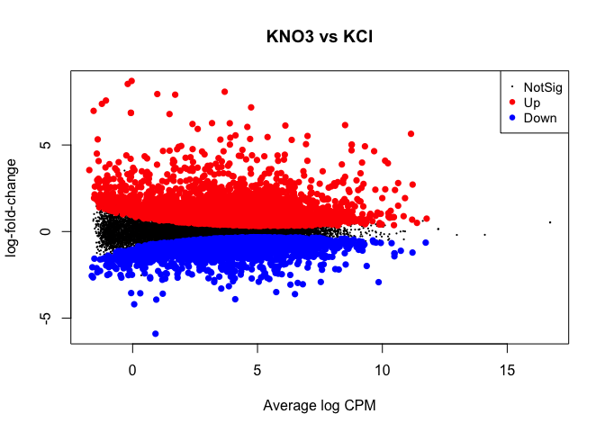
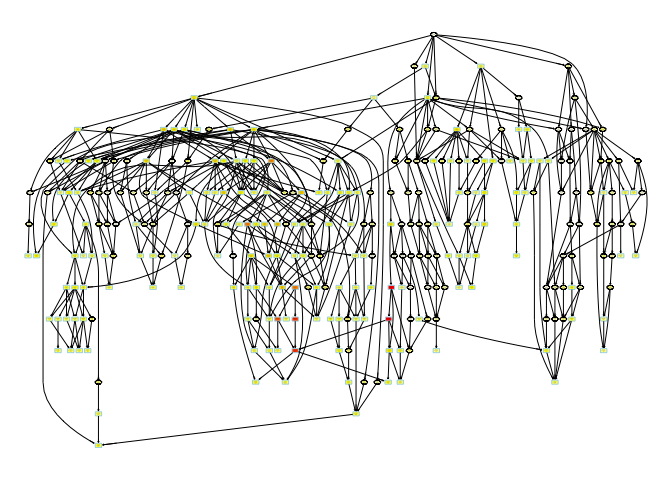

Session 3 | Part 1 : Gene expression analysis, control/treatment
experiment
================
Tomás Moyano
5/25/2020

### **Watch this [video](https://drive.google.com/file/d/1EdYCPAKTPI-Z28fyUF8ri1KzDw3nazgd/view) for a more detailed explanation of the following pipeline**

During this session, we will discover genes differentially expressed
when Arabidopsis’ shoot is grown with no nitrate (KCl treatment),
compared to its development with 5mM of nitrate. The samples analyzed
here were taken after 120 min of growth.

Open R Studio (or just R) and load the following libraries.

``` r
if (!requireNamespace("BiocManager", quietly = TRUE))
    install.packages("BiocManager")

BiocManager::install("DESeq2")
```

    ## 
    ## The downloaded binary packages are in
    ##  /var/folders/mq/q_8_31_564376clx2y7s1g4c0000gn/T//Rtmpif5pUj/downloaded_packages

``` r
BiocManager::install("edgeR")
```

    ## 
    ## The downloaded binary packages are in
    ##  /var/folders/mq/q_8_31_564376clx2y7s1g4c0000gn/T//Rtmpif5pUj/downloaded_packages

``` r
BiocManager::install("ViSEAGO")
BiocManager::install("Rgraphviz")
```

    ## 
    ## The downloaded binary packages are in
    ##  /var/folders/mq/q_8_31_564376clx2y7s1g4c0000gn/T//Rtmpif5pUj/downloaded_packages

``` r
BiocManager::install("topGO")
```

    ## 
    ## The downloaded binary packages are in
    ##  /var/folders/mq/q_8_31_564376clx2y7s1g4c0000gn/T//Rtmpif5pUj/downloaded_packages

``` r
library(DESeq2)
library(edgeR)
library(knitr)
library(dplyr)
library(ViSEAGO)
```

> Don’t forget to set the folder where you downloaded your files as the
> working directory.

``` r
setwd( "~/Documentos/pcamejo/")
getwd()
```

    ## [1] "/Users/tmoyano/Documentos/pcamejo"

### Importing and formatting data.

Start importing counts table and metadata associated to the samples
(previously downloaded from
[Data](https://github.com/ibioChile/Transcriptomics-R-Workshop-public/tree/master/Session3-Treatment_and_Multivariate/Data)
folder).

``` r
counts <- read.table("fc0.original.counts.session2-1.txt")
metadata <- read.table("metadata_session2-1.txt", header=TRUE)
kable(head(metadata))
```

| Sample     | Tissue | Treatment | Replicate | Time |
| :--------- | :----- | :-------- | --------: | ---: |
| SRR5440795 | Shoot  | KCl       |         1 |  120 |
| SRR5440804 | Shoot  | KCl       |         2 |  120 |
| SRR5440813 | Shoot  | KCl       |         3 |  120 |
| SRR5440822 | Shoot  | KNO3      |         1 |  120 |
| SRR5440831 | Shoot  | KNO3      |         2 |  120 |
| SRR5440840 | Shoot  | KNO3      |         3 |  120 |

We will fix the header of counts leaving only the sample
ID.

``` r
colnames(counts) <- sapply(strsplit(colnames(counts),".",fixed=TRUE), `[`, 1)
kable(head(counts))
```

|           | SRR5440795 | SRR5440804 | SRR5440813 | SRR5440822 | SRR5440831 | SRR5440840 |
| --------- | ---------: | ---------: | ---------: | ---------: | ---------: | ---------: |
| AT1G01010 |        613 |        740 |        502 |        277 |        295 |        511 |
| AT1G01020 |        243 |        260 |        230 |        275 |        284 |        386 |
| AT1G03987 |          2 |          1 |          0 |          0 |          0 |          0 |
| AT1G01030 |         95 |         78 |         71 |         53 |         62 |         72 |
| AT1G01040 |       1924 |       2405 |       1813 |       1472 |       1515 |       2207 |
| AT1G03993 |        143 |        187 |        148 |         87 |         97 |        192 |

Let’s order samples in metadata by Tissue, Treatment and Time. Then
order samples in counts table according to metadata.

``` r
metadata_s <- metadata %>% arrange(Tissue, Treatment,Time)
counts <- counts[,metadata_s$Sample]
dim(counts)
```

    ## [1] 32833     6

> This table has 6 samples and 32,833 genes.

Now, we will evaluate two different methods to determine differentially
expressed genes (DEGs) among treatment and control experiments:
[DESeq2](https://genomebiology.biomedcentral.com/articles/10.1186/s13059-014-0550-8)
and
[EdgeR](https://academic.oup.com/bioinformatics/article/26/1/139/182458).

As input, the DESeq2 and EdgeR package expects count data as obtained,
e.g., from RNA-seq or another high-throughput sequencing experiment, in
the form of a matrix of integer values. The count data are presented as
a table which reports, for each sample, the number of sequence fragments
that have been assigned to each gene. An important analysis question is
the quantification and statistical inference of systematic changes
between conditions, as compared to within-condition variability.

### 1\. DEseq2

The package DESeq2 provides methods to test for differential expression
by use of negative binomial generalized linear models; the estimates of
dispersion and logarithmic fold changes incorporate data-driven prior
distributions

In this case, we will compare the treatment and control data.

First, we will create an object describing the treatment condition
(‘KNO3’ if grown with nitrate or ‘KCl’ if grown with KCl instead)
associated with each column in the “counts”
table.

``` r
coldata <- data.frame(row.names = metadata$Sample, condition = metadata$Treatment)
coldata
```

    ##            condition
    ## SRR5440795       KCl
    ## SRR5440804       KCl
    ## SRR5440813       KCl
    ## SRR5440822      KNO3
    ## SRR5440831      KNO3
    ## SRR5440840      KNO3

The function *DESeqDataSetFromMatrix* can be used if you have a matrix
of read counts prepared (as we have from *RSubread*). With the count
matrix, `counts`, and the sample information, `coldata`, we can
construct a
DESeqDataSet:

``` r
dds <- DESeqDataSetFromMatrix( countData=counts,  colData=coldata, design=~condition)
```

    ## Warning in DESeqDataSet(se, design = design, ignoreRank): some variables in
    ## design formula are characters, converting to factors

``` r
dds
```

    ## class: DESeqDataSet 
    ## dim: 32833 6 
    ## metadata(1): version
    ## assays(1): counts
    ## rownames(32833): AT1G01010 AT1G01020 ... ATCG01300 ATCG01310
    ## rowData names(0):
    ## colnames(6): SRR5440795 SRR5440804 ... SRR5440831 SRR5440840
    ## colData names(1): condition

While it is not necessary to pre-filter low count genes before running
the DESeq2 functions, there are two reasons which make pre-filtering
useful: by removing rows in which there are very few reads, we reduce
the memory size of the `dds` data object, and we increase the speed of
the transformation and testing functions within DESeq2. Here we perform
a minimal pre-filtering to keep only rows that have at least 10 reads
total. Note that more strict filtering to increase power is
automatically applied via independent filtering on the mean of
normalized counts within the results function. This initial filter can
help you use less memory and get faster results.

``` r
keep <- rowSums(counts(dds)) >= 10
dds <- dds[keep,]
```

By default, R will choose a reference level for factors based on
alphabetical order. Then, if you never tell the DESeq2 functions which
level you want to compare against (e.g. which level represents the
control group), the comparisons will be based on the alphabetical order
of the levels (“KCl” first, then “KNO3”). There are two solutions: you
can either explicitly tell results which comparison to make using the
contrast argument (this will be shown later), or you can explicitly set
the factors levels. Setting the factor levels can be done in two ways,
either using factor:

``` r
dds$condition <- factor(dds$condition, levels = c("KCl","KNO3"))
```

…or using relevel, just specifying the reference level:

``` r
dds$condition <- relevel(dds$condition, ref = "KCl")
```

The standard differential expression analysis steps are wrapped into a
single function, `DESeq`. These steps include normalization by the size
of the libraries, and an adjustment in the dispersion of the data
specific to the DESeq2 package (see
<http://bioconductor.org/packages/release/bioc/html/DESeq2.html>). For
more information about how this function works, we recommend you to
check the manual page for `?DESeq` and the Methods section of the DESeq2
publication (Love, Huber, and Anders 2014). Results tables are generated
using the function `results`, which generates a table with log2 fold
changes, p-values and adjusted p-values.

``` r
dds <- DESeq(dds)
```

    ## estimating size factors

    ## estimating dispersions

    ## gene-wise dispersion estimates

    ## mean-dispersion relationship

    ## final dispersion estimates

    ## fitting model and testing

``` r
res01 <- results(dds, alpha=0.01)
summary(res01)
```

    ## 
    ## out of 24733 with nonzero total read count
    ## adjusted p-value < 0.01
    ## LFC > 0 (up)       : 3964, 16%
    ## LFC < 0 (down)     : 3202, 13%
    ## outliers [1]       : 7, 0.028%
    ## low counts [2]     : 959, 3.9%
    ## (mean count < 3)
    ## [1] see 'cooksCutoff' argument of ?results
    ## [2] see 'independentFiltering' argument of ?results

We can plot the normalized count for each gene. In this exampe we will
plot the smallest adjusted p-value
results.

``` r
plotCounts(dds, gene=which.min(res01$padj), intgroup="condition")
```

<!-- -->

Now, we can filter the results by the desired thresholds of fold change
level and adjusted p-values. In this case, we will select genes with
log2-fold changes (FC) greater than 1 (genes that doubled its
expression) and adjusted p-values \< 0.01. We will store filtered data
under the `filter` object:

``` r
res <- na.exclude(as.data.frame(res01))
filter <- res[(abs(res$log2FoldChange)>1 & res$padj<0.01),]
kable(head(filter))
```

|           |   baseMean | log2FoldChange |     lfcSE |        stat |    pvalue |      padj |
| --------- | ---------: | -------------: | --------: | ----------: | --------: | --------: |
| AT1G01140 | 1400.97090 |     \-1.595926 | 0.1417217 | \-11.260985 | 0.0000000 | 0.0000000 |
| AT1G01180 |  302.43644 |     \-1.189453 | 0.1882923 |  \-6.317055 | 0.0000000 | 0.0000000 |
| AT1G01210 |  302.37654 |       1.178980 | 0.1439125 |    8.192336 | 0.0000000 | 0.0000000 |
| AT1G04023 |   25.61436 |     \-1.623400 | 0.4312266 |  \-3.764610 | 0.0001668 | 0.0007664 |
| AT1G01240 |  252.60992 |     \-1.645231 | 0.2001039 |  \-8.221882 | 0.0000000 | 0.0000000 |
| AT1G01360 |  377.09737 |     \-1.551476 | 0.1507884 | \-10.289095 | 0.0000000 | 0.0000000 |

``` r
nrow(filter)
```

    ## [1] 2536

According to this analysis, there are 2,536 DEGs among treatment
conditions at time 120 min. A table with DEGs information can be
exported as a text file for further
analysis.

``` r
write.table(filter,"regulated_DESEQ2_log2FC1_padj0.01.txt", quote=F,sep="\t",  col.names = NA)
```

### 2\. EdgeR

Another widely used tool for differential expression analysis is edgeR.
This program uses a different method than DeSeq2, and therefore, results
may be different. The different results are not mutually exclusive,
since no statistical modeling can fully capture biological phenomena.
Statistical methods all rely on assumptions and requirements that are
only partially satisfied. Therefore, we always recommend to try a couple
of methods when analyzing this type of data.

In the previous step we load the counts and metadata file into a DeSeq2
object. Similarly, to run edgeR, we need to combine data counts and
metadata into a DGElist object:

``` r
dge <- DGEList(counts=counts,group=metadata$Treatment)
dge
```

    ## An object of class "DGEList"
    ## $counts
    ##           SRR5440795 SRR5440804 SRR5440813 SRR5440822 SRR5440831 SRR5440840
    ## AT1G01010        613        740        502        277        295        511
    ## AT1G01020        243        260        230        275        284        386
    ## AT1G03987          2          1          0          0          0          0
    ## AT1G01030         95         78         71         53         62         72
    ## AT1G01040       1924       2405       1813       1472       1515       2207
    ## 32828 more rows ...
    ## 
    ## $samples
    ##            group lib.size norm.factors
    ## SRR5440795   KCl 27424092            1
    ## SRR5440804   KCl 29670882            1
    ## SRR5440813   KCl 24655352            1
    ## SRR5440822  KNO3 27159857            1
    ## SRR5440831  KNO3 21662281            1
    ## SRR5440840  KNO3 33645234            1

Similarly to the DeSeq2 pipeline, we will include a step to filter out
lowly expressed gene. We will use the `filterByExpr` function. By
default, the function keeps genes with about 10 read counts or more.

``` r
keep <- filterByExpr(dge,group = metadata$Treatment)
dge <- dge[keep,,keep.lib.sizes=FALSE]
dge
```

    ## An object of class "DGEList"
    ## $counts
    ##           SRR5440795 SRR5440804 SRR5440813 SRR5440822 SRR5440831 SRR5440840
    ## AT1G01010        613        740        502        277        295        511
    ## AT1G01020        243        260        230        275        284        386
    ## AT1G01030         95         78         71         53         62         72
    ## AT1G01040       1924       2405       1813       1472       1515       2207
    ## AT1G03993        143        187        148         87         97        192
    ## 22168 more rows ...
    ## 
    ## $samples
    ##            group lib.size norm.factors
    ## SRR5440795   KCl 27408997            1
    ## SRR5440804   KCl 29655600            1
    ## SRR5440813   KCl 24642823            1
    ## SRR5440822  KNO3 27148582            1
    ## SRR5440831  KNO3 21649910            1
    ## SRR5440840  KNO3 33629007            1

> Note that the total number of genes changed compared to the previous
> step.

We will use the function `calcNormFactors` to estimate a set of scaling
factors, which minimizes differences in the distribution of log-fold
changes between samples. The default method for computing these scale
factors uses a trimmed mean of M-values (TMM) between each pair of
samples.

``` r
dge <- calcNormFactors(dge, method = "TMM")
dge
```

    ## An object of class "DGEList"
    ## $counts
    ##           SRR5440795 SRR5440804 SRR5440813 SRR5440822 SRR5440831 SRR5440840
    ## AT1G01010        613        740        502        277        295        511
    ## AT1G01020        243        260        230        275        284        386
    ## AT1G01030         95         78         71         53         62         72
    ## AT1G01040       1924       2405       1813       1472       1515       2207
    ## AT1G03993        143        187        148         87         97        192
    ## 22168 more rows ...
    ## 
    ## $samples
    ##            group lib.size norm.factors
    ## SRR5440795   KCl 27408997    1.0529397
    ## SRR5440804   KCl 29655600    1.0909225
    ## SRR5440813   KCl 24642823    1.0921152
    ## SRR5440822  KNO3 27148582    0.8303073
    ## SRR5440831  KNO3 21649910    1.0298066
    ## SRR5440840  KNO3 33629007    0.9322655

To compare Control vs Treatment samples, we need a design matrix with
“Treatment” conditions and to estimate the dispersion of the samples
(review
[Session 1](https://github.com/ibioChile/Transcriptomics-R-Workshop-public/blob/master/Session1-Temporal_Analysis/3_Pipeline-Gene_expression_analysis.md)
for more information):

``` r
design <- model.matrix(~metadata$Treatment)
dge <- estimateDisp(dge,design)
dge
```

    ## An object of class "DGEList"
    ## $counts
    ##           SRR5440795 SRR5440804 SRR5440813 SRR5440822 SRR5440831 SRR5440840
    ## AT1G01010        613        740        502        277        295        511
    ## AT1G01020        243        260        230        275        284        386
    ## AT1G01030         95         78         71         53         62         72
    ## AT1G01040       1924       2405       1813       1472       1515       2207
    ## AT1G03993        143        187        148         87         97        192
    ## 22168 more rows ...
    ## 
    ## $samples
    ##            group lib.size norm.factors
    ## SRR5440795   KCl 27408997    1.0529397
    ## SRR5440804   KCl 29655600    1.0909225
    ## SRR5440813   KCl 24642823    1.0921152
    ## SRR5440822  KNO3 27148582    0.8303073
    ## SRR5440831  KNO3 21649910    1.0298066
    ## SRR5440840  KNO3 33629007    0.9322655
    ## 
    ## $design
    ##   (Intercept) metadata$TreatmentKNO3
    ## 1           1                      0
    ## 2           1                      0
    ## 3           1                      0
    ## 4           1                      1
    ## 5           1                      1
    ## 6           1                      1
    ## attr(,"assign")
    ## [1] 0 1
    ## attr(,"contrasts")
    ## attr(,"contrasts")$`metadata$Treatment`
    ## [1] "contr.treatment"
    ## 
    ## 
    ## $common.dispersion
    ## [1] 0.02051295
    ## 
    ## $trended.dispersion
    ## [1] 0.01713290 0.01979831 0.03512127 0.01678679 0.02624431
    ## 22168 more elements ...
    ## 
    ## $tagwise.dispersion
    ## [1] 0.015453187 0.008288322 0.020317395 0.009187098 0.025562595
    ## 22168 more elements ...
    ## 
    ## $AveLogCPM
    ## [1] 4.133283 3.381550 1.432850 6.103309 2.377190
    ## 22168 more elements ...
    ## 
    ## $trend.method
    ## [1] "locfit"
    ## 
    ## $prior.df
    ## [1] 3.923536
    ## 
    ## $prior.n
    ## [1] 0.980884
    ## 
    ## $span
    ## [1] 0.2856151

The last step of this pipeline is to compute genewise exact tests for
differences between the two groups means. EdgeR asumes a
negative-binomially distribution. The function `topTags` extracts the
most differentially expressed genes from a test object, ranked either by
p-value or by absolute log-fold-change. In this case, we use this
function to sort the object `et` by adjusted p-values.

``` r
et <- exactTest(dge)
et.res<-topTags(et,n = dim(et$table)[1], adjust.method="BH")
kable(head(data.frame(et.res)))
```

|              |      logFC |     logCPM | PValue | FDR |
| ------------ | ---------: | ---------: | -----: | --: |
| AT3G48360    |   8.077385 |   3.686053 |      0 |   0 |
| AT1G78050    |   5.293743 |   6.369655 |      0 |   0 |
| AT1G24280    |   6.148905 |   8.507972 |      0 |   0 |
| AT3G63110    |   4.131848 |   4.978589 |      0 |   0 |
| AT5G40850    |   5.016462 |   8.769272 |      0 |   0 |
| AT4G05390    |   4.923463 |   9.301821 |      0 |   0 |
| We can see t | he results | as a plot: |        |     |

``` r
plotMD(et,p.value = 0.01,adjust.method = "fdr")
```

<!-- -->

Now, we will filter the results by the fold change level and adjusted
p-values. Again, we will select genes wit log2FC \> 1 and adjusted
p-value \<
0.01.

``` r
et.res.0.01_1<-et.res$table[et.res$table$FDR<0.01 & abs(et.res$table$logFC)>1,]
kable(head(et.res.0.01_1))
```

|           |    logFC |   logCPM | PValue | FDR |
| --------- | -------: | -------: | -----: | --: |
| AT3G48360 | 8.077385 | 3.686053 |      0 |   0 |
| AT1G78050 | 5.293743 | 6.369655 |      0 |   0 |
| AT1G24280 | 6.148905 | 8.507972 |      0 |   0 |
| AT3G63110 | 4.131848 | 4.978589 |      0 |   0 |
| AT5G40850 | 5.016462 | 8.769272 |      0 |   0 |
| AT4G05390 | 4.923463 | 9.301821 |      0 |   0 |

``` r
nrow(et.res.0.01_1)
```

    ## [1] 2661

According to this analysis, 2,661 genes were DE by treatment at time 120
min.

The resulting table can be written as text file for further
analysis.

``` r
write.table(et.res.0.01_1,"regulated_edgeR_log2FC1_padj0.01.txt", quote=F,sep="\t",  col.names = NA)
```

### 3\. Gene comparison

Now, let’s compare the results of both methods. For that, we will thera
are a lot of tool to intersect lists of genes and plot. In this exam’le,
we will use an “UpSet plot” with the list of DEGs reulting from both
DeSeq2 and EdgeR.

``` r
#install.packages("UpSetR")
library(UpSetR)

list.DE<-list(deseq=rownames(filter),edgeR=rownames(et.res.0.01_1))

upset(fromList(list.DE), order.by = "freq")
```

<!-- -->

There is a great overlap among the DEGs found by the two methods. There
is a large overlap between the DEG found by the two methods. There are a
few genes that are found exclusively by each method, this is because
different normalization and comparison methods are used. For more
information see <https://pubmed.ncbi.nlm.nih.gov/22988256/>.

### 4\. GO enrichment.

Once a list of DEGs has been obtained, it is useful to know the
biological functions in which those genes may be involved in. This can
be done by using specific databases, where the function of the
organisms’ genes has been previosuly identified. One of the most
widely used databases to describe genes is [Gene
Ontology](www.geneontology.org). This database is a collaborative
initiative, in which the information related to genes is stored using a
structured language.

There are a lot of tools to analyze lists of genes with gene ontology
data. In this example, we will utilize the ViSEAGO package of
Bioconductor
(<https://www.bioconductor.org/packages/release/bioc/html/ViSEAGO.html>).
Although ViSEAGO is prepared to be quickly used for model organisms (as
the case of Arabidopsis), in this example, the gene-function relation
(GOterm) will be loaded from the website
<http://current.geneontology.org/products/pages/downloads.html> (see
this session’s
[Requirements](https://github.com/ibioChile/Transcriptomics-R-Workshop-public/blob/master/Session3-Treatment_and_Multivariate/1_Requirements.md))

Read this
    file:

``` r
tair.gaf<-read.delim("tair.gaf.gz",comment.char = "!",fill=T,header=F)
```

    ## Warning in scan(file = file, what = what, sep = sep, quote = quote, dec = dec, :
    ## EOF within quoted string

``` r
kable(head(tair.gaf))
```

| V1   | V2            | V3        | V4 | V5           | V6                               | V7  | V8                 | V9 | V10       | V11                                                                                                                      | V12     | V13        | V14      | V15      | V16 | V17                |
| :--- | :------------ | :-------- | :- | :----------- | :------------------------------- | :-- | :----------------- | :- | :-------- | :----------------------------------------------------------------------------------------------------------------------- | :------ | :--------- | :------- | :------- | :-- | :----------------- |
| TAIR | locus:2031476 | ENO1      |    | <GO:0000015> | TAIR:AnalysisReference:501756966 | IEA | InterPro:IPR000941 | C  | AT1G74030 | AT1G74030|ENO1|enolase 1|F2P9.10|F2P9\_10                                                                                | protein | taxon:3702 | 20180904 | InterPro |     | TAIR:locus:2031476 |
| TAIR | locus:2043067 | ENOC      |    | <GO:0000015> | TAIR:AnalysisReference:501756966 | IEA | InterPro:IPR000941 | C  | AT2G29560 | AT2G29560|ENOC|ENO3|cytosolic enolase|enolase 3|F16P2.6|F16P2\_6                                                         | protein | taxon:3702 | 20190408 | InterPro |     | TAIR:locus:2043067 |
| TAIR | locus:2044851 | LOS2      |    | <GO:0000015> | TAIR:AnalysisReference:501756966 | IEA | InterPro:IPR000941 | C  | AT2G36530 | AT2G36530|LOS2|ENO2|LOW EXPRESSION OF OSMOTICALLY RESPONSIVE GENES 2|enolase 2|F1O11.16|F1O11\_16                        | protein | taxon:3702 | 20190408 | InterPro |     | TAIR:locus:2044851 |
| TAIR | locus:2032970 | AT1G25260 |    | <GO:0000027> | TAIR:AnalysisReference:501756966 | IEA | InterPro:IPR033867 | P  | AT1G25260 | AT1G25260|F4F7.35|F4F7\_35                                                                                               | protein | taxon:3702 | 20190404 | InterPro |     | TAIR:locus:2032970 |
| TAIR | locus:2017963 | TUN       |    | <GO:0000030> | TAIR:AnalysisReference:501756966 | IEA | InterPro:IPR026051 | F  | AT1G16570 | AT1G16570|TUN|TURAN|F19K19.11|F19K19\_11                                                                                 | protein | taxon:3702 | 20180718 | InterPro |     | TAIR:locus:2017963 |
| TAIR | locus:2043343 | ALG3      |    | <GO:0000030> | TAIR:AnalysisReference:501756966 | IEA | InterPro:IPR007873 | F  | AT2G47760 | AT2G47760|ALG3|AtALG3|asparagine-linked glycosylation 3|Arabidopsis thaliana asparagine-linked glycosylation 3|F17A22.15 | protein | taxon:3702 | 20180718 | InterPro |     | TAIR:locus:2043343 |

Let’s select the columns needed to load Gene Ontology information into
the database:

``` r
library(GO.db)
```

    ## Loading required package: AnnotationDbi

    ## 
    ## Attaching package: 'AnnotationDbi'

    ## The following object is masked from 'package:dplyr':
    ## 
    ##     select

``` r
goframeData<-(tair.gaf[,c(10,3,5,7)])# This is specific for this file

kable(head(goframeData))
```

| V10       | V3        | V5           | V7  |
| :-------- | :-------- | :----------- | :-- |
| AT1G74030 | ENO1      | <GO:0000015> | IEA |
| AT2G29560 | ENOC      | <GO:0000015> | IEA |
| AT2G36530 | LOS2      | <GO:0000015> | IEA |
| AT1G25260 | AT1G25260 | <GO:0000027> | IEA |
| AT1G16570 | TUN       | <GO:0000030> | IEA |
| AT2G47760 | ALG3      | <GO:0000030> | IEA |

``` r
goframeData<-goframeData[as.matrix(nchar(as.matrix(goframeData[,1])))==9,] # This is specific for this file
goframeData<-cbind("Arabidopsis",goframeData)
colnames(goframeData)<-c("taxid","gene_id","gene_symbol","GOID","evidence")
goframeData<-goframeData[goframeData$GOID%in%keys(GO.db),]
write.table(goframeData,"goframeData.arabidopsis",row.names = F,sep="\t",quote=F)
kable(head(goframeData))
```

| taxid       | gene\_id  | gene\_symbol | GOID         | evidence |
| :---------- | :-------- | :----------- | :----------- | :------- |
| Arabidopsis | AT1G74030 | ENO1         | <GO:0000015> | IEA      |
| Arabidopsis | AT2G29560 | ENOC         | <GO:0000015> | IEA      |
| Arabidopsis | AT2G36530 | LOS2         | <GO:0000015> | IEA      |
| Arabidopsis | AT1G25260 | AT1G25260    | <GO:0000027> | IEA      |
| Arabidopsis | AT1G16570 | TUN          | <GO:0000030> | IEA      |
| Arabidopsis | AT2G47760 | ALG3         | <GO:0000030> | IEA      |

To build a customizable database for ViSEAGO, you need to run the
folwwing code. The GO file is then loaded into `myGENE2GO` as a
structured object, and the hierarchical gene ontology tree is then built
from the annotations.

``` r
library(ViSEAGO)

Custom<-ViSEAGO::Custom2GO(file = "goframeDAta.arabidopsis")
myGENE2GO<-ViSEAGO::annotate(  "Arabidopsis",  Custom )  

myGENE2GO
```

    ## - object class: gene2GO
    ## - database: Custom
    ## - stamp/version: goframeDAta.arabidopsis
    ## - organism id: Arabidopsis
    ## 
    ## GO annotations:
    ## - Molecular Function (MF): 18458 annotated genes with 29760 terms (1775 unique terms)
    ## - Biological Process (BP): 19823 annotated genes with 32510 terms (2162 unique terms)
    ## - Cellular Component (CC): 11272 annotated genes with 18469 terms (550 unique terms)

Then, we load the parameters to perform this analysis. For this case, we
will use a DESeq2 object previously generated and select genes from the
intersection of edgeR and DeSeq2. We will define as “background
universe” the total list of genes being expressed in the plant. For
Gene Ontology analysis, we can select data from different ontology
categories. In this case, the “biological processes (BP)” category will
be used.

``` r
background <- names(dds)

selection <- intersect(rownames(filter),rownames(et.res.0.01_1))

BP<-ViSEAGO::create_topGOdata(geneSel=selection, allGenes=background,  gene2GO=myGENE2GO,   ont="BP",  nodeSize=5)
```

    ## Loading required package: topGO

    ## Loading required package: graph

    ## Loading required package: SparseM

    ## 
    ## Attaching package: 'SparseM'

    ## The following object is masked from 'package:base':
    ## 
    ##     backsolve

    ## 
    ## groupGOTerms:    GOBPTerm, GOMFTerm, GOCCTerm environments built.

    ## 
    ## Attaching package: 'topGO'

    ## The following object is masked from 'package:IRanges':
    ## 
    ##     members

    ## 
    ## Building most specific GOs .....

    ##  ( 2120 GO terms found. )

    ## 
    ## Build GO DAG topology ..........

    ##  ( 4129 GO terms and 8911 relations. )

    ## 
    ## Annotating nodes ...............

    ##  ( 15630 genes annotated to the GO terms. )

``` r
classic<-topGO::runTest(BP,  algorithm ="classic",  statistic = "fisher")
```

    ## 
    ##           -- Classic Algorithm -- 
    ## 
    ##       the algorithm is scoring 1514 nontrivial nodes
    ##       parameters: 
    ##           test statistic: fisher

``` r
classic
```

    ## 
    ## Description: Custom Arabidopsis goframeDAta.arabidopsis 
    ## Ontology: BP 
    ## 'classic' algorithm with the 'fisher' test
    ## 2079 GO terms scored: 170 terms with p < 0.01
    ## Annotation data:
    ##     Annotated genes: 15630 
    ##     Significant genes: 1634 
    ##     Min. no. of genes annotated to a GO: 5 
    ##     Nontrivial nodes: 1514

Finally, the results can be displayed as a table or a gene ontology
tree:

``` r
# merge results
BP_sResults<-ViSEAGO::merge_enrich_terms(  Input=list(  condition=c("BP","classic")  ))
```

    ## 'select()' returned 1:1 mapping between keys and columns

``` r
# display the merged table
```

The resulting table can be written as text file for further analyses.

``` r
# print the merged table in a file
ViSEAGO::show_table(  BP_sResults,  "GO_intersect.deseq_edgeR_genes.BP.txt")
BP_sResults.table<-read.table("GO_intersect.deseq_edgeR_genes.BP.txt",header = T,row.names=1)

kable(head(BP_sResults.table))
```

|              | term                                    | definition                                                                                                                                                                                                                                                                                              | condition.genes\_frequency | condition.pvalue | condition..log10\_pvalue | condition.Significant\_genes                                                                                                                                                                                                                                                                                                                                                      | condition.Significant\_genes\_symbol                                                                                                                                                                                              |
| ------------ | :-------------------------------------- | :------------------------------------------------------------------------------------------------------------------------------------------------------------------------------------------------------------------------------------------------------------------------------------------------------ | :------------------------- | ---------------: | -----------------------: | :-------------------------------------------------------------------------------------------------------------------------------------------------------------------------------------------------------------------------------------------------------------------------------------------------------------------------------------------------------------------------------- | :-------------------------------------------------------------------------------------------------------------------------------------------------------------------------------------------------------------------------------- |
| <GO:0000027> | ribosomal large subunit assembly        | The aggregation, arrangement and bonding together of constituent RNAs and proteins to form the large ribosomal subunit.                                                                                                                                                                                 | 57.14% (4/7)               |        0.0032116 |                     2.49 | AT1G25260;AT1G61580;AT2G37190;AT5G60670                                                                                                                                                                                                                                                                                                                                           | AT1G25260;RPL3B;AT2G37190;RPL12C                                                                                                                                                                                                  |
| <GO:0000154> | rRNA modification                       | The covalent alteration of one or more nucleotides within an rRNA molecule to produce an rRNA molecule with a sequence that differs from that coded genetically.                                                                                                                                        | 27.69% (18/65)             |        0.0000825 |                     4.08 | AT1G03502;AT1G03935;AT1G74453;AT1G74456;AT2G05765;AT2G20721;AT2G35742;AT2G35744;AT2G35747;AT2G43137;AT3G47342;AT3G47347;AT3G47348;AT3G50825;AT4G39361;AT4G39366;AT5G26180;AT5G57280                                                                                                                                                                                               | AT1G03502;AT1G03935;AT1G74453;AT1G74456;AT2G05765;AT2G20721;AT2G35742;AT2G35744;HID1;AT2G43137;AT3G47342;AT3G47347;AT3G47348;AT3G50825;AT4G39361;AT4G39366;NSUN5;RID2                                                             |
| <GO:0000160> | phosphorelay signal transduction system | A conserved series of molecular signals found in prokaryotes and eukaryotes; involves autophosphorylation of a histidine kinase and the transfer of the phosphate group to an aspartate that then acts as a phospho-donor to response regulator proteins.                                               | 20.22% (37/183)            |        0.0000616 |                     4.21 | AT1G10470;AT1G10480;AT1G12630;AT1G12890;AT1G12980;AT1G19050;AT1G44830;AT1G68550;AT1G71520;AT1G74890;AT2G01830;AT2G17820;AT2G22200;AT2G39250;AT2G41310;AT2G46310;AT2G47520;AT3G16280;AT3G23230;AT3G25890;AT3G48100;AT3G54320;AT3G57040;AT4G06746;AT4G11140;AT4G17490;AT4G23750;AT4G27950;AT4G31920;AT4G39780;AT5G19790;AT5G24470;AT5G52020;AT5G53290;AT5G62920;AT5G64750;AT5G67180 | ARR4;ZFP5;AT1G12630;AT1G12890;ESR1;ARR7;ERF014;CRF10;AT1G71520;ARR15;WOL;HK1;AT2G22200;SNZ;RR3;CRF5;ERF71;AT3G16280;TDR1;CRF11;RR5;WRI1;ARR9;RAP2.9;CRF1;ERF6;CRF2;CRF4;RR10;AT4G39780;RAP2.11;PRR5;AT5G52020;CRF3;ARR6;ABR1;TOE3 |
| <GO:0000302> | response to reactive oxygen species     | Any process that results in a change in state or activity of a cell or an organism (in terms of movement, secretion, enzyme production, gene expression, etc.) as a result of a reactive oxygen species stimulus. Reactive oxygen species include singlet oxygen, superoxide, and oxygen free radicals. | 24.44% (11/45)             |        0.0055985 |                     2.25 | AT1G07400;AT1G32540;AT1G56650;AT2G29500;AT2G46370;AT3G17790;AT3G48360;AT4G02380;AT4G37610;AT5G01600;AT5G63160                                                                                                                                                                                                                                                                     | AT1G07400;LOL1;PAP1;AT2G29500;JAR1;PAP17;BT2;SAG21;BT5;FER1;BT1                                                                                                                                                                   |
| <GO:0000470> | maturation of LSU-rRNA                  | Any process involved in the maturation of a precursor Large SubUnit (LSU) ribosomal RNA (rRNA) molecule into a mature LSU-rRNA molecule.                                                                                                                                                                | 80% (4/5)                  |        0.0005456 |                     3.26 | AT1G80750;AT2G44120;AT3G58660;AT5G22440                                                                                                                                                                                                                                                                                                                                           | RPL7A;AT2G44120;AT3G58660;AT5G22440                                                                                                                                                                                               |
| <GO:0002181> | cytoplasmic translation                 | The chemical reactions and pathways resulting in the formation of a protein in the cytoplasm. This is a ribosome-mediated process in which the information in messenger RNA (mRNA) is used to specify the sequence of amino acids in the protein.                                                       | 41.18% (7/17)              |        0.0010165 |                     2.99 | AT1G07070;AT1G27400;AT2G37600;AT3G49910;AT4G26230;AT4G31790;AT5G67510                                                                                                                                                                                                                                                                                                             | AT1G07070;AT1G27400;AT2G37600;AT3G49910;AT4G26230;AT4G31790;AT5G67510                                                                                                                                                             |

``` r
showSigOfNodes(GOdata = BP,score(classic) , useInfo = 'all',firstSigNodes = nrow(BP_sResults.table))
```

    ## Loading required package: Rgraphviz

    ## Loading required package: grid

    ## 
    ## Attaching package: 'grid'

    ## The following object is masked from 'package:topGO':
    ## 
    ##     depth

    ## 
    ## Attaching package: 'Rgraphviz'

    ## The following objects are masked from 'package:IRanges':
    ## 
    ##     from, to

    ## The following objects are masked from 'package:S4Vectors':
    ## 
    ##     from, to

    ## Warning in arrows(head_from[1], head_from[2], head_to[1], head_to[2], col =
    ## edgeColor, : zero-length arrow is of indeterminate angle and so skipped
    
    ## Warning in arrows(head_from[1], head_from[2], head_to[1], head_to[2], col =
    ## edgeColor, : zero-length arrow is of indeterminate angle and so skipped
    
    ## Warning in arrows(head_from[1], head_from[2], head_to[1], head_to[2], col =
    ## edgeColor, : zero-length arrow is of indeterminate angle and so skipped
    
    ## Warning in arrows(head_from[1], head_from[2], head_to[1], head_to[2], col =
    ## edgeColor, : zero-length arrow is of indeterminate angle and so skipped

<!-- -->

    ## $dag
    ## A graphNEL graph with directed edges
    ## Number of Nodes = 299 
    ## Number of Edges = 562 
    ## 
    ## $complete.dag
    ## [1] "A graph with 299 nodes."

``` r
printGraph(BP, classic, firstSigNodes = nrow(BP_sResults.table), fn.prefix = "BP", useInfo = "all", pdfSW = TRUE)
```

    ## BP_classic_170_all  --- no of nodes:  299

\`\`\`
